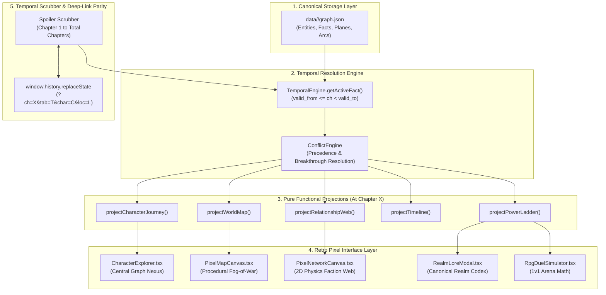

# OmniLore System Architecture & Technical Specification

> **System:** OmniLore (Temporal Knowledge Graph & Spoiler-Free World Explorer)  
> **Status:** Active Production Specification  
> **Version:** 2.0  
> **Repository:** `omni-lore`  

---

## 🏛️ 1. Architecture Overview

OmniLore decouples raw canonical lore storage from point-in-time visual presentation through a **Pure Functional Projection Pipeline**:



---

## 📐 2. Canonical Lore Graph Schema

Every universe is modeled as a directed, temporal multigraph serialized to `data/<slug>/graph.json`.

### 2.1 Core Types (`src/domain/types.ts`)

```typescript
export interface CanonicalLoreGraph {
  series: SeriesMetadata;
  power_system: PowerSystem;
  entities: Record<string, Entity>;       // Characters, Factions, Locations, Items
  facts: Record<string, Fact>;             // Temporal point-in-time attributes
  planes: Plane[];                         // Cosmological spatial planes
  arcs: Arc[];                             // Chronological narrative arcs
}
```

### 2.2 Entities
Entities represent persistent objects in the universe.
* **CharacterEntity:** `id`, `name`, `aliases`, `first_appearance`, `avatar_url`, `description`.
* **FactionEntity:** `id`, `name`, `leader_id`, `emblem_url`, `description`, `color`.
* **LocationEntity:** `id`, `name`, `plane_id`, `coordinates: { x, y }`, `first_appearance`, `danger_level`.
* **ItemEntity:** `id`, `name`, `type: 'artifact' | 'weapon' | 'pill'`, `first_appearance`.

### 2.3 Facts (The Temporal Unit)
Instead of mutating character attributes, state changes are stored as append-only **temporal facts**:
```typescript
export interface Fact<T = any> {
  id: string;
  subject_id: string;            // e.g. "linley-baruch"
  predicate: string;             // "stage" | "faction" | "location" | "status" | "relationship"
  value: T;                      // Target value or related entity ID
  valid_from: number;            // Beginning chapter of validity
  valid_to?: number;             // Chapter when this fact was superseded (null if current)
  metadata?: Record<string, any>;// e.g. relationship label ("Master", "Rival")
}
```

---

## ⏱️ 3. Temporal Resolution & Conflict Handling

### 3.1 Point-in-Time Active Fact Resolution
For any entity and predicate, the active fact at `userChapter` is resolved via:
```typescript
export class TemporalEngine {
  static getActiveFact<T>(
    subjectId: string,
    predicate: string,
    facts: Fact[],
    userChapter: number
  ): Fact<T> | null {
    const matching = facts.filter((f) =>
      f.subject_id === subjectId &&
      f.predicate === predicate &&
      f.valid_from <= userChapter &&
      (f.valid_to === undefined || f.valid_to === null || f.valid_to > userChapter)
    );

    if (matching.length === 0) return null;
    if (matching.length === 1) return matching[0];

    // Conflict resolution: highest valid_from wins (latest canonical breakthrough)
    return matching.sort((a, b) => b.valid_from - a.valid_from)[0];
  }
}
```

### 3.2 Secret Identity Masking
When a character operates under an alias (e.g. Klein Moretti as *Sherlock Moriarty* or *Gehrman Sparrow*):
1. The projection engine checks whether `userChapter >= unmask_chapter`.
2. If before the unmask chapter, `displayName` resolves to the current active alias and `isMasked = true`.
3. In the UI, masked characters display with the `[UNKNOWN ENIGMA]` badge and an `EyeOff` indicator to prevent identity spoilers.

---

## 🚀 4. Pure Functional Projection Pipelines

All projections reside in [`src/projections/`](file:///Users/deepaknaik/Downloads/world-building/omni-lore/src/projections/) and operate deterministically:

### 4.1 Power Ladder Projection (`power-ladder.ts`)
- Evaluates each character's active `stage` fact at `userChapter`.
- Groups characters into ordered tiers (`T1` to `TN`).
- Highlights recent breakthroughs (`achieved_at_chapter === userChapter`).
- Exposes full codex metadata (advancement criteria, phenomena, mortality risks).

### 4.2 Relationship & Faction Web Projection (`relationship-web.ts`)
- Gathers active `relationship` facts where `valid_from <= userChapter < valid_to`.
- Filters out nodes whose `first_appearance > userChapter`.
- Categorizes edges into: `ally`, `master`, `disciple`, `rival`, `enemy`, `family`, `faction`.
- Generates 2D force simulation nodes and edges for [`PixelNetworkCanvas.tsx`](file:///Users/deepaknaik/Downloads/world-building/omni-lore/src/components/pixel/PixelNetworkCanvas.tsx).

### 4.3 World Map & Cartography Projection (`world-map.ts`)
- Returns planes and locations discovered by `userChapter`.
- Marks locations as `discovered` (`first_appearance <= userChapter`) or `uncharted` (`first_appearance > userChapter`).
- Constructs the chronological story voyage path polyline for discovered locations.

### 4.4 Story Timeline Projection (`timeline.ts`)
- Returns narrative arcs active or completed by `userChapter`.
- Filters events strictly to `event.chapter <= userChapter`.
- Categorizes events into `battle`, `breakthrough`, `political`, `discovery`, `tragedy`.

### 4.5 Character Journey Projection (`character-journey.ts`)
- Generates a complete stepped progression line of power stages (past achieved, current, and locked future stages).
- Aggregates categorized relationships, visited geographic footprint, and chronological milestones.

---

## ⚔️ 5. RPG Duel Simulator Engine

The Duel Simulator ([`duel-simulator.ts`](file:///Users/deepaknaik/Downloads/world-building/omni-lore/src/engine/duel-simulator.ts)) calculates dynamic battle outcomes based on characters' temporal power at `userChapter`:

$$P = \text{BasePower} \times (\text{RealmMultiplier})^{\text{tier}} \times (1 + \text{BreakthroughBonus}) \times \text{AffiliationBonus}$$

- **Turn Resolution:** Multi-round turn-based combat simulation calculating offensive strikes, barrier mitigations, and critical breakthroughs.
- **Narrative Log:** Produces authentic retro battle commentary ("Linley channels Baruch Dragonblood armor!").
- **Audio Feedback:** Synthesizes combat sound effects via Web Audio API.

---

## 🔗 6. URL State & Deep Linking Parity

To enable snapshot sharing, bookmarking, and instant state restoration:
- **URL Schema:** `/[slug]?ch=<number>&tab=<tab_name>&char=<character_id>&loc=<location_id>`
- **Mount Hydration:** Reads URL params on initial load to set `userChapter`, `activeTab`, `selectedCharacterId`, and `selectedLocationId`.
- **State Synchronization:** Uses `window.history.replaceState` in a `useEffect` hook to update the browser URL bar in real-time as the slider moves without triggering Next.js server re-renders.
- **Share Snapshot:** Copies full stateful URL to clipboard with feedback toast.

---

## 🧩 7. OmniLore Reader — Chrome Extension Architecture

The OmniLore Reader Chrome Extension (`chrome-extension/`) operates as a lightweight, zero-latency reader companion directly inside modern manga, manhwa, and web novel reading platforms:

```text
                    ┌──────────────────────┐
                    │     WEBTOON / NOVEL  │
                    │     MANGA READER     │
                    └──────────┬───────────┘
                               │
                       Chapter Detection (DOM & URL)
                               │
                               ▼
                    ┌──────────────────────┐
                    │  OMNILORE EXTENSION  │
                    │      SIDE PANEL      │
                    └──────────┬───────────┘
                               │
                    series + chapter + context
                               │
                               ▼
                    ┌──────────────────────┐
                    │ Extension Temporal   │
                    │   Client (Offline)   │
                    │                      │
                    │  "What is known      │
                    │   at Chapter 147?"   │
                    └──────────┬───────────┘
                               │
                 ┌─────────────┼─────────────┐
                 ▼             ▼             ▼
             Character      Secrets       Power
              Roster       / Events       Ranking
                 │             │             │
                 └─────────────┼─────────────┘
                               ▼
                    ┌──────────────────────┐
                    │   GAME-HUD SIDEPANEL │
                    ├──────────────────────┤
                    │ Chapter 147          │
                    │ 🛡️ Shield: SAFE      │
                    │                      │
                    │ 👤 Characters        │
                    │ ⚡ Power Ladder      │
                    │ 🔐 Secrets           │
                    │ 🕸 Relationships     │
                    │ ⚔ Duel (Simulated)   │
                    │ 💬 Ask Chapter       │
                    └──────────────────────┘
```

1. **Manifest V3 Ephemeral Background Worker (`background/service-worker.ts`):**
   - Configured with `chrome.sidePanel.setPanelBehavior({ openPanelOnActionClick: true })` for native one-click side panel access.
   - Preserves tab reading state in `chrome.storage.session`.
   - Listens to context menu clicks (`"OmniLore: Who is '%s'?"`) to trigger instant zero-spoiler character lookups without switching tabs.
2. **Active Chapter Detectors (`content/detectors/`):**
   - Pluggable adapter architecture (`mangaplus.ts`, `webnovel.ts`, `wuxiaworld.ts`, `tapas.ts`, `generic.ts`).
   - Evaluates page URL pathnames, title tags, and reader viewer headers to extract `{ seriesTitle, seriesSlug, chapterNumber, confidence }`.
3. **100% Offline Temporal Engine Client (`temporal/temporal-client.ts`):**
   - Bundles all 5 normalized universe lore graphs (~790 KB total) into the client bundle.
   - Evaluates point-in-time entity debuts, power stage breakthroughs, active factions, and identity unmasking on the fly.
4. **Retro Game-HUD Side Panel (`sidepanel/app.tsx`):**
   - **Spoiler Shield Selector:** 3 selectable shield levels (`🛡️ SAFE`, `⚠️ CONTEXT`, `🔥 FULL`).
   - **Mini RPG Duel Simulator:** Simulates turn-based battles at exact chapter parity with the mandatory disclaimer: *"Simulation — not canon"*.
   - **Grounded Chapter Oracle:** Answers questions strictly grounded in temporal graph facts revealed up to the reader's current chapter.

---

## 🧪 8. Quality & Verification Standards

1. **Automated Testing:**
   All 8 test suites (46 unit tests) run in under 300ms using Vitest:
   - `tests/temporal-engine.test.ts`: Fact intervals, masking, temporal boundary enforcement.
   - `tests/projections.test.ts`: Ladder, web, map, timeline, and journey transforms.
   - `tests/duel-simulator.test.ts`: Battle formula and scaling calculations.
   - `tests/sound-effects.test.ts`: Audio synthesizer safety and mute toggling.
   - `tests/conflict-engine.test.ts`: Tie-breaking and latest breakthrough prioritization.
   - `tests/pixel-converter.test.ts`: Procedural SVG pixelation algorithms.
   - `tests/datastore.test.ts`: Canonical graph schema validation across all 5 universes.
   - `tests/extension.test.ts`: Reader detector adapters, title normalization, temporal snapshots, and mini-duels.
2. **Build Integrity:**
   - Web App: `npm run build` compiles clean static and dynamic routes with Next.js Turbopack.
   - Chrome Extension: `npm run build:extension` compiles unpacked bundles into `chrome-extension/dist` with `esbuild`.

