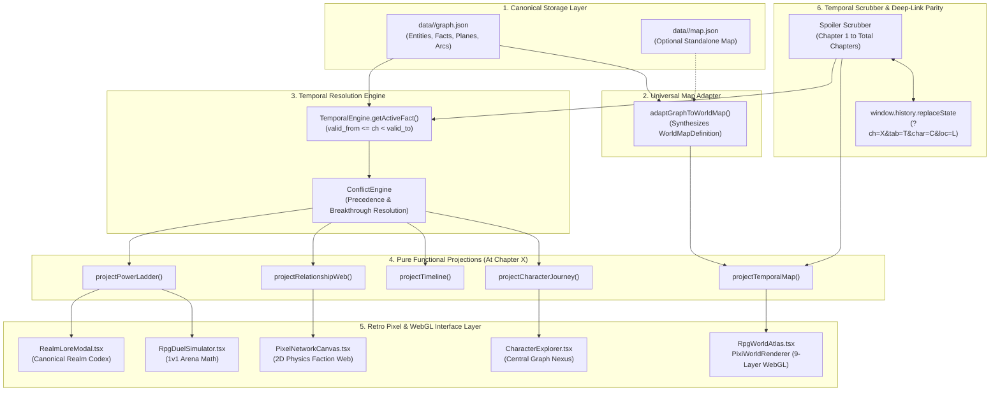
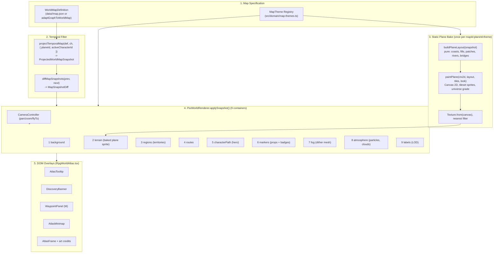

# OmniLore System Architecture & Technical Specification

> **System:** OmniLore (Temporal Knowledge Graph & Spoiler-Free World Explorer)  
> **Status:** Active Production Specification  
> **Version:** 2.0  
> **Repository:** `omni-lore`  

---

## 🏛️ 1. Architecture Overview

OmniLore decouples raw canonical lore storage from point-in-time visual presentation through a **Pure Functional Projection Pipeline**:



---

## 📐 2. Canonical Lore Graph Schema

Every universe is modeled as a directed, temporal multigraph serialized to `data/<slug>/graph.json`.

### 2.1 Core Types (`src/domain/types.ts`)

```typescript
export interface CanonicalLoreGraph {
  series: SeriesMetadata;
  power_system: PowerSystem;
  entities: Record<string, Entity>;       // Characters, Factions, Locations, Items
  facts: Record<string, Fact>;             // Temporal point-in-time attributes
  planes: Plane[];                         // Cosmological spatial planes
  arcs: Arc[];                             // Chronological narrative arcs
}
```

### 2.2 Entities
Entities represent persistent objects in the universe.
* **CharacterEntity:** `id`, `name`, `aliases`, `first_appearance`, `avatar_url`, `description`.
* **FactionEntity:** `id`, `name`, `leader_id`, `emblem_url`, `description`, `color`.
* **LocationEntity:** `id`, `name`, `plane_id`, `coordinates: { x, y }`, `first_appearance`, `danger_level`.
* **ItemEntity:** `id`, `name`, `type: 'artifact' | 'weapon' | 'pill'`, `first_appearance`.

### 2.3 Facts (The Temporal Unit)
Instead of mutating character attributes, state changes are stored as append-only **temporal facts**:
```typescript
export interface Fact<T = any> {
  id: string;
  subject_id: string;            // e.g. "linley-baruch"
  predicate: string;             // "stage" | "faction" | "location" | "status" | "relationship"
  value: T;                      // Target value or related entity ID
  valid_from: number;            // Beginning chapter of validity
  valid_to?: number;             // Chapter when this fact was superseded (null if current)
  metadata?: Record<string, any>;// e.g. relationship label ("Master", "Rival")
}
```

---

## ⏱️ 3. Temporal Resolution & Conflict Handling

### 3.1 Point-in-Time Active Fact Resolution
For any entity and predicate, the active fact at `userChapter` is resolved via:
```typescript
export class TemporalEngine {
  static getActiveFact<T>(
    subjectId: string,
    predicate: string,
    facts: Fact[],
    userChapter: number
  ): Fact<T> | null {
    const matching = facts.filter((f) =>
      f.subject_id === subjectId &&
      f.predicate === predicate &&
      f.valid_from <= userChapter &&
      (f.valid_to === undefined || f.valid_to === null || f.valid_to > userChapter)
    );

    if (matching.length === 0) return null;
    if (matching.length === 1) return matching[0];

    // Conflict resolution: highest valid_from wins (latest canonical breakthrough)
    return matching.sort((a, b) => b.valid_from - a.valid_from)[0];
  }
}
```

### 3.2 Secret Identity Masking
When a character operates under an alias (e.g. Klein Moretti as *Sherlock Moriarty* or *Gehrman Sparrow*):
1. The projection engine checks whether `userChapter >= unmask_chapter`.
2. If before the unmask chapter, `displayName` resolves to the current active alias and `isMasked = true`.
3. In the UI, masked characters display with the `[UNKNOWN ENIGMA]` badge and an `EyeOff` indicator to prevent identity spoilers.

---

## 🚀 4. Pure Functional Projection Pipelines

All projections reside in [`src/projections/`](file:///Users/deepaknaik/Downloads/world-building/omni-lore/src/projections/) and operate deterministically:

### 4.1 Power Ladder Projection (`power-ladder.ts`)
- Evaluates each character's active `stage` fact at `userChapter`.
- Groups characters into ordered tiers (`T1` to `TN`).
- Highlights recent breakthroughs (`achieved_at_chapter === userChapter`).
- Exposes full codex metadata (advancement criteria, phenomena, mortality risks).

### 4.2 Relationship & Faction Web Projection (`relationship-web.ts`)
- Gathers active `relationship` facts where `valid_from <= userChapter < valid_to`.
- Filters out nodes whose `first_appearance > userChapter`.
- Categorizes edges into: `ally`, `master`, `disciple`, `rival`, `enemy`, `family`, `faction`.
- Generates 2D force simulation nodes and edges for [`PixelNetworkCanvas.tsx`](file:///Users/deepaknaik/Downloads/world-building/omni-lore/src/components/pixel/PixelNetworkCanvas.tsx).

### 4.3 World Map & Temporal Cartography Projections (`temporal-map.ts` & `map-adapter.ts`)
- [`projectTemporalMap()`](file:///Users/deepaknaik/Downloads/world-building/omni-lore/src/projections/temporal-map.ts): Pure functional projection taking a [`WorldMapDefinition`](file:///Users/deepaknaik/Downloads/world-building/omni-lore/src/domain/map-types.ts) and `userChapter`, outputting an immutable [`ProjectedWorldMapSnapshot`](file:///Users/deepaknaik/Downloads/world-building/omni-lore/src/projections/temporal-map.ts).
  - Filters locations strictly by `discovery_chapter <= userChapter`.
  - Determines Fog of War status (`discovered`, `visible_in_fog`, `hidden`) with dynamic clearing apertures (landmarks: 105px, active character posts: 125px, travel routes: 80px).
  - Evaluates active controlling factions at `userChapter` across all territorial spheres.
  - Slices protagonist journey waypoints and routes up to the reader's current chapter.
  - Filters spatial historical events strictly prior to `userChapter`.
- [`adaptGraphToWorldMap()`](file:///Users/deepaknaik/Downloads/world-building/omni-lore/src/projections/map-adapter.ts): Universal fallback projection ensuring zero breaking changes for graphs without a bespoke `map.json`.
  - Synthesizes Zod-validated map definitions dynamically from `LocationEntity`, `PlaneEntity`, `EventEntity`, and temporal character facts.
  - Inferred location types, auto-generated bounding box regions, chronologically linked voyage routes, and territorial influence spheres.

### 4.4 Story Timeline Projection (`timeline.ts`)
- Returns narrative arcs active or completed by `userChapter`.
- Filters events strictly to `event.chapter <= userChapter`.
- Categorizes events into `battle`, `breakthrough`, `political`, `discovery`, `tragedy`.

### 4.5 Character Journey Projection (`character-journey.ts`)
- Generates a complete stepped progression line of power stages (past achieved, current, and locked future stages).
- Aggregates categorized relationships, visited geographic footprint, and chronological milestones.

---

## 🗺️ 5. Map Engine v3 — Level-Select Tileset Atlas

Map Engine v3 replaces v2's vector-only cartography with a **Diablo-style level-select atlas**: a Canvas-2D-baked tileset plane (grass, forest, mountains, coasts, rivers) underneath the same retained, diff-driven PixiJS scene graph, so the world reads like a real map instead of colored polygons. The projection, diff and 9-container facade are unchanged in shape; only the terrain layer's art pipeline and the DOM overlay set grew.



### 5.1 The 9-Layer Retained Scene Graph
`PixiWorldRenderer` ([`pixi-world-renderer.ts`](file:///Users/deepaknaik/Downloads/world-building/omni-lore/src/engine/map/pixi-world-renderer.ts)) keeps the 9 public top-level containers from v2, now populated by one class per layer under [`src/engine/map/layers/`](file:///Users/deepaknaik/Downloads/world-building/omni-lore/src/engine/map/layers/):
1. `backgroundContainer` — void beyond the plane edges.
2. `terrainContainer` — the **baked plane sprite** (backdrop, terrain, coasts, rivers, bridges and decoration only — landmark glyphs are *not* baked: they are chapter-gated and drawn live in the markers layer), one `Texture` per `(mapId, planeId, theme.slug)`, cached in `staticCache` and re-baked only when that key changes.
3. `regionsContainer` — [`regions-layer.ts`](file:///Users/deepaknaik/Downloads/world-building/omni-lore/src/engine/map/layers/regions-layer.ts): hover-highlighted borders and faction territory tints.
4. `routesContainer` — [`routes-layer.ts`](file:///Users/deepaknaik/Downloads/world-building/omni-lore/src/engine/map/layers/routes-layer.ts): animated pixel-dash roads, sea lanes, flight/portal arcs, dashed secret routes.
5. `characterPathContainer` — [`hero-layer.ts`](file:///Users/deepaknaik/Downloads/world-building/omni-lore/src/engine/map/layers/hero-layer.ts) + [`hero-walker.ts`](file:///Users/deepaknaik/Downloads/world-building/omni-lore/src/engine/map/layers/hero-walker.ts): the framed hero token walking the dirt-path trail at constant speed, capped at 1.6s, never past `userChapter`.
6. `markersContainer` — [`markers-layer.ts`](file:///Users/deepaknaik/Downloads/world-building/omni-lore/src/engine/map/layers/markers-layer.ts): retained, id-keyed tileset props (or code-drawn fallback icons), landmark glyphs, event flags, and numbered journey badges from [`journey-numbers.ts`](file:///Users/deepaknaik/Downloads/world-building/omni-lore/src/projections/journey-numbers.ts).
7. `fogContainer` — [`fog-layer.ts`](file:///Users/deepaknaik/Downloads/world-building/omni-lore/src/engine/map/layers/fog-layer.ts) + [`fog-apertures.ts`](file:///Users/deepaknaik/Downloads/world-building/omni-lore/src/engine/map/layers/fog-apertures.ts) + [`fog-material.ts`](file:///Users/deepaknaik/Downloads/world-building/omni-lore/src/engine/map/layers/fog-material.ts): a low-res reveal mask rendered into a `RenderTexture`, shown through a world-anchored Bayer-dither `Mesh` shader. The shader source (`FOG_VERTEX_SRC`/`FOG_FRAGMENT_SRC`) is deliberately written for **GLSL ES 1.00**, not 3.00: PixiJS only injects `#version 300 es` (and the `in`/`out`/`texture`/`finalColor` shims) when the source itself declares that version, so any 3.00-only construct — array literals, non-constant array indexing, `uint`, bitwise ops — fails to compile as GLSL ES 1.00, regardless of whether the underlying context is WebGL1 or WebGL2 (commit `d73dd01` fixed exactly this). `tests/fog-material.test.ts` scans the source for those constructs.
8. `atmosphereContainer` — [`atmosphere-layer.ts`](file:///Users/deepaknaik/Downloads/world-building/omni-lore/src/engine/map/layers/atmosphere-layer.ts) + [`fx-layer.ts`](file:///Users/deepaknaik/Downloads/world-building/omni-lore/src/engine/map/layers/fx-layer.ts): per-universe particles, drifting cloud shadows, cursor torch-light, discovery bursts, warp spirals.
9. `labelsContainer` — [`labels-layer.ts`](file:///Users/deepaknaik/Downloads/world-building/omni-lore/src/engine/map/layers/labels-layer.ts): Silkscreen `BitmapText` labels (browser) / `Text` (tests) with zoom-based LOD.

### 5.2 Coalescing Snapshot Queue
`renderSnapshot()`/`applySnapshot()` both funnel into a private `enqueue()`: each call bumps a `requestSeq`, chains onto `this.chain`, and a stale commit (superseded by a newer `seq` before its turn runs) is silently dropped. `full` re-bakes (`pendingFull`, a `planeId`/`mapId`/theme change, or a failed commit) redo the static plane and reset camera/fog/atmosphere. Every commit — full or not — re-syncs all six live layers (regions, routes, markers, hero, fog, labels) with the new snapshot; `diffMapSnapshots(prev, next)` doesn't gate *which* layers update, it drives *how they animate*: the hero layer walks instead of teleporting, markers fade in instead of popping, and `diff.newlyDiscoveredIds` triggers discovery bursts and the `onDiscover` callback. This means rapid chapter scrubbing never queues a backlog of stale renders — only the newest snapshot in flight is ever committed.

### 5.3 Static Plane Bake vs. Live Layers
The terrain layer's bake cache key is `${mapId}:${planeId}:${theme.slug}` — no chapter in it, so the bake is **never** chapter-gated; it only changes when the map, plane or universe theme changes, not when `userChapter` moves. Baking is pure and deterministic, split as:
- [`plane-layout.ts`](file:///Users/deepaknaik/Downloads/world-building/omni-lore/src/engine/map/scene/plane-layout.ts) — `buildPlaneLayout(snapshot)`: world→pixel space at `PIXELS_PER_WORLD = 0.5` (16px tile = 32 world units); coast roughening via seeded fractal midpoint displacement (capped ~256 vertices/ring); fills in terrain order (`lake` vs open `water`); grass tone patches, forest/lone trees, mountain peaks, desert rocks, oasis palms (seeded value-noise + jittered grids, y-sorted); rivers + bridges. Pure, no Pixi/DOM imports, unit-tested directly.
- [`plane-painter.ts`](file:///Users/deepaknaik/Downloads/world-building/omni-lore/src/engine/map/scene/plane-painter.ts) — `paintPlane(ctx2d, layout, tiles, look)`: browser-only Canvas 2D executor (backdrop → open-water fill → shelf/shallows/sand rim/foam → ground fills incl. lakes → grass tone patches → river strokes → bridges → stamps → per-universe color grade). Tested with a recording fake 2D context.
- [`tile-atlas.ts`](file:///Users/deepaknaik/Downloads/world-building/omni-lore/src/engine/map/scene/tile-atlas.ts) — loads the tileset sheets once via Pixi `Assets` (deduplicated by URL so React StrictMode's double-mount never double-unloads them) and serves both nearest-filtered sub-textures (live layers) and raw sheet images (the Canvas 2D painter).
- [`sprite-catalog.ts`](file:///Users/deepaknaik/Downloads/world-building/omni-lore/src/engine/map/scene/sprite-catalog.ts) — sheet table (url, size, license, credit), sprite rectangles, and the location-type → prop map.
- [`universe-look.ts`](file:///Users/deepaknaik/Downloads/world-building/omni-lore/src/engine/map/scene/universe-look.ts) — per-universe `tint`/`amount`/`saturation` color grade plus water/sand/foam/fog colors; pure `gradePixels()`.
- [`noise.ts`](file:///Users/deepaknaik/Downloads/world-building/omni-lore/src/engine/map/scene/noise.ts), [`prng.ts`](file:///Users/deepaknaik/Downloads/world-building/omni-lore/src/engine/map/scene/prng.ts), [`geometry.ts`](file:///Users/deepaknaik/Downloads/world-building/omni-lore/src/engine/map/scene/geometry.ts) — seeded value noise/fbm, `mulberry32`/`hashString` (never `Math.random` for baked art), and pure 2D geometry (`jagPolygon`, polyline helpers).
- [`pixel-palette.ts`](file:///Users/deepaknaik/Downloads/world-building/omni-lore/src/engine/map/scene/pixel-palette.ts), [`pixel-sprites.ts`](file:///Users/deepaknaik/Downloads/world-building/omni-lore/src/engine/map/scene/pixel-sprites.ts), [`icon-atlas.ts`](file:///Users/deepaknaik/Downloads/world-building/omni-lore/src/engine/map/scene/icon-atlas.ts) — the surviving code-drawn art (fallback location icons, landmark glyphs, waypoint pylon, `DANGER_COLORS`), baked to cached textures once per theme.

Live layers (markers, routes, hero, fog, labels, atmosphere) read `snapshot`/`diff` every commit and are never baked, so all chapter-gated content (locations, names, events, routes, territories, the hero trail, labels, planes) stays dynamic.

### 5.4 Camera, Input & Picking
- [`camera-controller.ts`](file:///Users/deepaknaik/Downloads/world-building/omni-lore/src/engine/map/camera-controller.ts): pure-math pan/zoom (0.3x–4.0x)/`flyTo()` with cubic easing and boundary clamping; frustum sync feeds `AtlasMinimap`.
- [`input/gesture-tracker.ts`](file:///Users/deepaknaik/Downloads/world-building/omni-lore/src/engine/map/input/gesture-tracker.ts): pure pointer state machine distinguishing click vs. drag (threshold) and reporting two-finger pinch scale.
- [`input/picking.ts`](file:///Users/deepaknaik/Downloads/world-building/omni-lore/src/engine/map/input/picking.ts): deterministic world-space hit testing for markers/events/regions, used instead of Pixi's per-object events so drags never fire clicks.
- [`anim/tween.ts`](file:///Users/deepaknaik/Downloads/world-building/omni-lore/src/engine/map/anim/tween.ts): keyed ticker-driven tweens that retarget in place, so rapid scrubbing never builds an animation queue.
- [`layers/layer-context.ts`](file:///Users/deepaknaik/Downloads/world-building/omni-lore/src/engine/map/layers/layer-context.ts): the shared `{ theme, atlas, tiles, ... }` dependency bag handed to every layer.

### 5.5 Projection & Diff Layer
- [`temporal-map.ts`](file:///Users/deepaknaik/Downloads/world-building/omni-lore/src/projections/temporal-map.ts) — `projectTemporalMap(def, userChapter, { planeId, activeCharacterId })`: the sole source of every visible map element (spec §7); all spoiler filtering lives here, never in the renderer.
- [`map-snapshot-diff.ts`](file:///Users/deepaknaik/Downloads/world-building/omni-lore/src/projections/map-snapshot-diff.ts) — `diffMapSnapshots(prev, next)`: pure comparison of two snapshots (`newlyDiscoveredIds`, marker/route changes) so the renderer animates instead of redrawing; `isDiscoveredStatus()` is the shared discovered-vs-KNOWN test used by markers, fog apertures and journey numbering.
- [`journey-numbers.ts`](file:///Users/deepaknaik/Downloads/world-building/omni-lore/src/projections/journey-numbers.ts) — `journeyNumbers(snapshot)`: numbers each discovered location by the order the active character first visited it on the active plane, from the already chapter- and plane-filtered snapshot only.
- [`map-adapter.ts`](file:///Users/deepaknaik/Downloads/world-building/omni-lore/src/projections/map-adapter.ts) — `adaptGraphToWorldMap(graph)`: universal fallback that synthesizes a Zod-validated `WorldMapDefinition` from canonical graph entities for universes without a hand-authored `map.json`. Its journey routes are **per-segment**: one two-point route per consecutive pair of the lead character's waypoints (id `route-<char>-path-<planeId>-<n>`), dropped when the pair crosses planes or stays on one spot, and visible from `max(later waypoint chapter, debut of every location the leg passes through)` — so a leg appears only once both ends are reached and never points at a future landmark.
- [`route-gating.ts`](file:///Users/deepaknaik/Downloads/world-building/omni-lore/src/projections/route-gating.ts) — `locationsOnRoute()` / `routeGateChapter()`: a route "passes through" a location when one of its points lies within `ROUTE_STOP_RADIUS` (1 world unit) of that location on the same plane; its gate is the latest such debut. Used by the adapter and by `scripts/author-reverend-insanity-map.ts` (which re-gates the hand-authored Reverend Insanity routes). `tests/route-spoilers.test.ts` checks all six universes at every route/location boundary chapter.
- [`map-planes.ts`](file:///Users/deepaknaik/Downloads/world-building/omni-lore/src/domain/map-planes.ts) — plane resolution: a `WorldMapDefinition` without `planes` gets one implicit `'main'` plane; entities without `planeId` belong to the first plane.

### 5.6 Multi-Plane Rules & Deep Linking
- The URL keeps `?ch=&tab=&char=&loc=` and adds `plane=<id>`. `world-explorer.tsx` defaults `char` from a hard-coded per-universe protagonist table (`zhuo-fan`, `luffy`, `sung-jin-woo`, `klein-moretti`, `fang-yuan`, `linley-baruch`); only when the slug is missing from that table (or the id isn't in the graph) does it fall back to the character with the longest mapped journey, then any character entity.
- Without `?plane=`, `RpgWorldAtlas` opens on the plane the active character stands on at `userChapter` (if revealed), else the first plane — `resolveAtlasPlaneId()` in `atlas-ui-state.ts`. The choice is derived, not stored, so it writes no `plane=`; an explicit `?plane=` always wins.
- Requesting a plane the projection can't currently show (sealed, or an id that doesn't resolve) doesn't fail silently: `projectTemporalMap` falls back to a plane it *can* show and returns that as `snapshot.planeId`; `RpgWorldAtlas` notices `planeId !== snapshot.planeId` and calls `switchPlane(snapshot.planeId)`, which round-trips through `onSelectPlane` into `world-explorer.tsx`'s `selectedPlaneId` state, and that state is what the URL-sync effect writes back into `?plane=`.
- `PixiWorldRenderer.commit()` treats any `planeId`/`mapId` change as a full re-sync: it re-bakes the static plane (or reuses the cached texture for that key), resets camera fit, fog resize, and atmosphere seed, and (if a previous snapshot existed) plays a warp burst at the plane's center.
- Unrevealed planes appear only in the HUD plane dropdown (`MapHudControls`), as a locked `??? SEALED REALM` entry that cannot be selected; the waypoint panel (`M`) lists only revealed planes that have discovered waypoints.
- Cross-plane travel (waypoint panel or a landmark beyond the current plane) triggers `switchPlane()` plus a pending fly-to so the camera lands on the destination after the new plane's snapshot commits.

### 5.7 Rivers
`WorldMapDefinition.rivers?: MapRiver[]` (`{ id, name, points, width, planeId?, bridges? }`) are geography, never chapter-gated — `snapshot.rivers` is simply "rivers on the active plane." `buildPlaneLayout` strokes them and draws bridges at the recorded points; `ocean`/`river`-typed terrain polygons whose centroid lies inside a land fill **and** whose bounding box that land fill's bounding box fully contains become **lakes** (sand rim, shallows) while others are open sea painted under the coastline.

### 5.8 Zero-Spoiler Rules (spec §7)
1. **Geography is intentionally ungated; names are gated.** The baked layer (terrain, coastlines, lakes, rivers, bridges, decoration) is built from chapter-1 data because land shape is not a narrative spoiler — a real atlas shows the whole continent. Anything that carries story information (location markers/names, labels, region names, events, routes, the hero trail, territories, landmark glyphs, planes) stays chapter-gated in the projection.
2. **No bake-time clearing around locations** — clearing the trees around an unrevealed location at bake time would pin down *where* it is before it's discovered. Only visible (chapter-gated) markers draw their own grass clearing under themselves.
3. Tooltips, labels, badges, the waypoint list, the discovery banner, minimap and plane list all derive from the snapshot/diff, never from raw graph data.
4. KNOWN (undiscovered) locations render as a dark silhouette at 70% alpha, `??? UNCHARTED`, no pylon, no badge. They can be hovered but never selected: `isSelectableTarget()` (`input/picking.ts`) makes clicks on them (or on event flags standing on them) a no-op, and the dossier ignores a `?loc=` pointing at one.
5. The hero token is never interpolated past the projected position; journey badges only number visits ≤ the current chapter.
6. Unrevealed planes appear only as `??? SEALED REALM`.
7. Routes never draw toward an undiscovered location: every route is gated to the latest debut of the locations it passes through (`route-gating.ts`).

### 5.9 DOM Overlays ([`src/components/map/`](file:///Users/deepaknaik/Downloads/world-building/omni-lore/src/components/map/))
[`RpgWorldAtlas.tsx`](file:///Users/deepaknaik/Downloads/world-building/omni-lore/src/components/map/RpgWorldAtlas.tsx) owns the canvas + URL state and composes:
- [`atlas-ui-state.ts`](file:///Users/deepaknaik/Downloads/world-building/omni-lore/src/components/map/atlas-ui-state.ts) — pure helpers building tooltip/banner/waypoint-group models from the snapshot only.
- [`AtlasTooltip.tsx`](file:///Users/deepaknaik/Downloads/world-building/omni-lore/src/components/map/AtlasTooltip.tsx) — hover card (type, danger via `DANGER_COLORS`, faction, first-seen chapter), or `??? UNCHARTED` for KNOWN locations.
- [`DiscoveryBanner.tsx`](file:///Users/deepaknaik/Downloads/world-building/omni-lore/src/components/map/DiscoveryBanner.tsx) — coalescing "NEW AREA DISCOVERED (+N MORE)" banner.
- [`WaypointPanel.tsx`](file:///Users/deepaknaik/Downloads/world-building/omni-lore/src/components/map/WaypointPanel.tsx) — `M`-key travel list of discovered waypoints grouped by revealed plane and region (sealed realms appear only in the HUD plane dropdown).
- [`AtlasMinimap.tsx`](file:///Users/deepaknaik/Downloads/world-building/omni-lore/src/components/map/AtlasMinimap.tsx) — pixelated overview with live camera frustum.
- [`AtlasFrame.tsx`](file:///Users/deepaknaik/Downloads/world-building/omni-lore/src/components/map/AtlasFrame.tsx) — ornate pixel frame with universe-rune corners and the "Art:" credit links (CC-BY attribution).
- [`MapHudControls.tsx`](file:///Users/deepaknaik/Downloads/world-building/omni-lore/src/components/map/MapHudControls.tsx), [`MapLocationDrawer.tsx`](file:///Users/deepaknaik/Downloads/world-building/omni-lore/src/components/map/MapLocationDrawer.tsx), [`MapTimelineBar.tsx`](file:///Users/deepaknaik/Downloads/world-building/omni-lore/src/components/map/MapTimelineBar.tsx) — carried over from v2 (plane/layer/search controls, dossier drawer, arc/chapter scrubber).

### 5.10 Multi-Universe MapTheme Registry ([`map-themes.ts`](file:///Users/deepaknaik/Downloads/world-building/omni-lore/src/domain/map-themes.ts))
Backdrop/accent palette per universe (background color, particle palette); combined with `UNIVERSE_LOOKS` (the tileset color grade — see DESIGN_SYSTEM.md § 6.4) for the full per-universe mood:
- **Reverend Insanity:** Obsidian-jade backdrop (`#0a1712`), jade tileset grade, emerald accents, ink-mist fog, floating Gu essence motes.
- **Lord of the Mysteries:** Abyssal violet backdrop (`#0d0b1a`), Victorian violet-fog tileset grade, celestial starlight motes.
- **Coiling Dragon:** Warm earthly amber (`#1a1409`), amber tileset grade, elemental essence motes.
- **Demonic Emperor:** Dark indigo/blood shadow (`#0f0a1c`), crimson-dusk tileset grade, soul flame particles.
- **Solo Leveling:** Neon hunter blue (`#04111f`), dark dungeon-blue tileset grade, azure monarch mana motes.
- **One Piece:** Grand Line navy (`#071926`), bright-ocean tileset grade, sea foam particles.

### 5.11 Universal Map Fallback Adapter
`map-adapter.ts` (5.5) ensures 100% backward compatibility: reads `data/<slug>/map.json` if hand-authored (Reverend Insanity), otherwise synthesizes a complete `WorldMapDefinition` from the canonical graph on the fly.

---

## ⚔️ 6. RPG Duel Simulator Engine

The Duel Simulator ([`duel-simulator.ts`](file:///Users/deepaknaik/Downloads/world-building/omni-lore/src/engine/duel-simulator.ts)) calculates dynamic battle outcomes based on characters' temporal power at `userChapter`:

$$P = \text{BasePower} \times (\text{RealmMultiplier})^{\text{tier}} \times (1 + \text{BreakthroughBonus}) \times \text{AffiliationBonus}$$

- **Turn Resolution:** Multi-round turn-based combat simulation calculating offensive strikes, barrier mitigations, and critical breakthroughs.
- **Narrative Log:** Produces authentic retro battle commentary ("Linley channels Baruch Dragonblood armor!").
- **Audio Feedback:** Synthesizes combat sound effects via Web Audio API.

---

## 🔗 7. URL State & Deep Linking Parity

To enable snapshot sharing, bookmarking, and instant state restoration:
- **URL Schema:** `/[slug]?ch=<number>&tab=<tab_name>&char=<character_id>&loc=<location_id>`
- **Mount Hydration:** Reads URL params on initial load to set `userChapter`, `activeTab`, `selectedCharacterId`, and `selectedLocationId`.
- **State Synchronization:** Uses `window.history.replaceState` in a `useEffect` hook to update the browser URL bar in real-time as the slider moves without triggering Next.js server re-renders.
- **Share Snapshot:** Copies full stateful URL to clipboard with feedback toast.

---

## 🧩 8. OmniLore Reader — Chrome Extension Architecture

The OmniLore Reader Chrome Extension (`chrome-extension/`) operates as a lightweight, zero-latency reader companion directly inside modern manga, manhwa, and web novel reading platforms:

```text
                    ┌──────────────────────┐
                    │     WEBTOON / NOVEL  │
                    │     MANGA READER     │
                    └──────────┬───────────┘
                               │
                       Chapter Detection (DOM & URL)
                               │
                               ▼
                    ┌──────────────────────┐
                    │  OMNILORE EXTENSION  │
                    │      SIDE PANEL      │
                    └──────────┬───────────┘
                               │
                    series + chapter + context
                               │
                               ▼
                    ┌──────────────────────┐
                    │ Extension Temporal   │
                    │   Client (Offline)   │
                    │                      │
                    │  "What is known      │
                    │   at Chapter 147?"   │
                    └──────────┬───────────┘
                               │
                 ┌─────────────┼─────────────┐
                 ▼             ▼             ▼
             Character      Secrets       Power
              Roster       / Events       Ranking
                 │             │             │
                 └─────────────┼─────────────┘
                               ▼
                    ┌──────────────────────┐
                    │   GAME-HUD SIDEPANEL │
                    ├──────────────────────┤
                    │ Chapter 147          │
                    │ 🛡️ Shield: SAFE      │
                    │                      │
                    │ 👤 Characters        │
                    │ ⚡ Power Ladder      │
                    │ 🔐 Secrets           │
                    │ 🕸 Relationships     │
                    │ ⚔ Duel (Simulated)   │
                    │ 💬 Ask Chapter       │
                    └──────────────────────┘
```

1. **Manifest V3 Ephemeral Background Worker (`background/service-worker.ts`):**
   - Configured with `chrome.sidePanel.setPanelBehavior({ openPanelOnActionClick: true })` for native one-click side panel access.
   - Preserves tab reading state in `chrome.storage.session`.
   - Listens to context menu clicks (`"OmniLore: Who is '%s'?"`) to trigger instant zero-spoiler character lookups without switching tabs.
2. **Active Chapter Detectors (`content/detectors/`):**
   - Pluggable adapter architecture (`mangaplus.ts`, `webnovel.ts`, `wuxiaworld.ts`, `tapas.ts`, `generic.ts`).
   - Evaluates page URL pathnames, title tags, and reader viewer headers to extract `{ seriesTitle, seriesSlug, chapterNumber, confidence }`.
3. **100% Offline Temporal Engine Client (`temporal/temporal-client.ts`):**
   - Bundles all 5 normalized universe lore graphs (~790 KB total) into the client bundle.
   - Evaluates point-in-time entity debuts, power stage breakthroughs, active factions, and identity unmasking on the fly.
4. **Retro Game-HUD Side Panel (`sidepanel/app.tsx`):**
   - **Spoiler Shield Selector:** 3 selectable shield levels (`🛡️ SAFE`, `⚠️ CONTEXT`, `🔥 FULL`).
   - **Mini RPG Duel Simulator:** Simulates turn-based battles at exact chapter parity with the mandatory disclaimer: *"Simulation — not canon"*.
   - **Grounded Chapter Oracle:** Answers questions strictly grounded in temporal graph facts revealed up to the reader's current chapter.

---

## 🧪 9. Quality & Verification Standards

1. **Automated Testing:**
   All 37 test suites (312 unit tests) run in about a second using Vitest:
   - [`tests/temporal-engine.test.ts`](file:///Users/deepaknaik/Downloads/world-building/omni-lore/tests/temporal-engine.test.ts): Fact intervals, masking, temporal boundary enforcement.
   - [`tests/conflict-engine.test.ts`](file:///Users/deepaknaik/Downloads/world-building/omni-lore/tests/conflict-engine.test.ts): Priority tie-breaking and latest breakthrough prioritization.
   - [`tests/projections.test.ts`](file:///Users/deepaknaik/Downloads/world-building/omni-lore/tests/projections.test.ts): Ladder, web, map, timeline, and journey transforms.
   - [`tests/duel-simulator.test.ts`](file:///Users/deepaknaik/Downloads/world-building/omni-lore/tests/duel-simulator.test.ts): Battle formula and scaling calculations.
   - [`tests/sound-effects.test.ts`](file:///Users/deepaknaik/Downloads/world-building/omni-lore/tests/sound-effects.test.ts): Audio synthesizer safety and mute toggling.
   - [`tests/pixel-converter.test.ts`](file:///Users/deepaknaik/Downloads/world-building/omni-lore/tests/pixel-converter.test.ts): Procedural SVG pixelation algorithms.
   - [`tests/datastore.test.ts`](file:///Users/deepaknaik/Downloads/world-building/omni-lore/tests/datastore.test.ts): Canonical graph schema validation across all universes.
   - [`tests/user-progress.test.ts`](file:///Users/deepaknaik/Downloads/world-building/omni-lore/tests/user-progress.test.ts): Progress persistence, chapter nudges, and bookmarking.
   - [`tests/map-schema.test.ts`](file:///Users/deepaknaik/Downloads/world-building/omni-lore/tests/map-schema.test.ts): Zod validation for WorldMapDefinition, regions, routes, rivers and layers.
   - [`tests/temporal-map.test.ts`](file:///Users/deepaknaik/Downloads/world-building/omni-lore/tests/temporal-map.test.ts): Zero-spoiler map projection, fog status, and aperture calculations.
   - [`tests/temporal-map-planes.test.ts`](file:///Users/deepaknaik/Downloads/world-building/omni-lore/tests/temporal-map-planes.test.ts): Multi-plane snapshot filtering, `planeId` selection, cross-plane waypoints.
   - [`tests/map-planes.test.ts`](file:///Users/deepaknaik/Downloads/world-building/omni-lore/tests/map-planes.test.ts): Implicit `'main'` plane resolution and entity plane defaulting; `WorldMapSchema` multi-plane Zod validation (plane-bounded coordinates, unknown-plane/duplicate-id rejection, river/bridge and landmark-glyph plane bounds-checking).
   - [`tests/map-themes.test.ts`](file:///Users/deepaknaik/Downloads/world-building/omni-lore/tests/map-themes.test.ts): Theme registry token validation and fallback defaults.
   - [`tests/pixi-renderer.test.ts`](file:///Users/deepaknaik/Downloads/world-building/omni-lore/tests/pixi-renderer.test.ts): `CameraController` viewport/zoom/pan/flyTo math; `PixiWorldRenderer` instantiates with 9 containers, renders snapshot elements, toggles layers, coalesces rapid snapshots to the newest only, does a full re-sync + camera refit on plane switch, reports forward-only discoveries, rebuilds on theme change, deterministic hover/click picking, recovers from a throwing commit without wedging the queue, and never commits after `destroy()`.
   - [`tests/rpg-atlas-component.test.ts`](file:///Users/deepaknaik/Downloads/world-building/omni-lore/tests/rpg-atlas-component.test.ts): RpgWorldAtlas React HUD controls, plane switching, and search filtering.
   - [`tests/reverend-insanity.test.ts`](file:///Users/deepaknaik/Downloads/world-building/omni-lore/tests/reverend-insanity.test.ts): Reverend Insanity graph integrity, 9-tier Gu power system, 3 planes, and persona unmasking.
   - [`tests/map-adapter.test.ts`](file:///Users/deepaknaik/Downloads/world-building/omni-lore/tests/map-adapter.test.ts): Universal graph-to-map fallback synthesis across legacy universes.
   - [`tests/extension.test.ts`](file:///Users/deepaknaik/Downloads/world-building/omni-lore/tests/extension.test.ts): Reader detector adapters, title normalization, temporal snapshots, and mini-duels.
   - [`tests/map-geometry.test.ts`](file:///Users/deepaknaik/Downloads/world-building/omni-lore/tests/map-geometry.test.ts): `mulberry32`/`hashString` determinism, polygon bounds/centroid/point-in-polygon, `jagPolygon` coast roughening.
   - [`tests/plane-layout.test.ts`](file:///Users/deepaknaik/Downloads/world-building/omni-lore/tests/plane-layout.test.ts): `buildPlaneLayout` determinism; stamps land inside terrain and outside water/rivers; forest has trees, mountains have peaks, desert has none; y-sorting; pixel scale.
   - [`tests/plane-painter.test.ts`](file:///Users/deepaknaik/Downloads/world-building/omni-lore/tests/plane-painter.test.ts): `paintPlane` against a recording fake 2D context — backdrop first, one `drawImage` per stamp, grade applied once, missing-sheet tolerance.
   - [`tests/pixel-palette.test.ts`](file:///Users/deepaknaik/Downloads/world-building/omni-lore/tests/pixel-palette.test.ts): Color math, `DANGER_COLORS`, sprite palettes, `UNIVERSE_LOOKS` bounds (`fogOpacity` 0.4–0.7), `gradePixels`.
   - [`tests/pixel-sprites.test.ts`](file:///Users/deepaknaik/Downloads/world-building/omni-lore/tests/pixel-sprites.test.ts): Code-drawn fallback icons, landmark glyphs and pylon pixel grids.
   - [`tests/icon-atlas.test.ts`](file:///Users/deepaknaik/Downloads/world-building/omni-lore/tests/icon-atlas.test.ts): `IconAtlas` bakes each code-drawn sprite once per theme at its full grid frame size and caches it; `Texture.EMPTY` without a baker; disposal destroys every baked texture.
   - [`tests/sprite-catalog.test.ts`](file:///Users/deepaknaik/Downloads/world-building/omni-lore/tests/sprite-catalog.test.ts): Every sheet ships at its declared size with every sprite rectangle inside it and a credit on CC-BY sheets; location types map to defined sprites; `TileAtlas` serves cached sub-textures framed to the sprite rect and returns `Texture.EMPTY` before loading or after `destroy()`.
   - [`tests/fog-material.test.ts`](file:///Users/deepaknaik/Downloads/world-building/omni-lore/tests/fog-material.test.ts): Fog shader source stays GLSL ES 1.00-compatible; Bayer-4 threshold math; dither density constants.
   - [`tests/fog-apertures.test.ts`](file:///Users/deepaknaik/Downloads/world-building/omni-lore/tests/fog-apertures.test.ts): Pure aperture model — which circles are open and target-radius animation.
   - [`tests/hero-layer.test.ts`](file:///Users/deepaknaik/Downloads/world-building/omni-lore/tests/hero-layer.test.ts): `HeroWalker` speed/duration-cap/retargeting/teleport math; `HeroLayer` teleports on the first snapshot then walks on forward scrubs, teleports under reduced motion or huge jumps, hides the token with no path, keeps the full trail once a walk completes.
   - [`tests/markers-layer.test.ts`](file:///Users/deepaknaik/Downloads/world-building/omni-lore/tests/markers-layer.test.ts): `journeyNumbers` first-visit ordering; `MarkersLayer` tileset props vs. fallback icons, KNOWN silhouettes (no pylon/badge), add/remove across chapters, fade-in, hover scale, danger-ring reduced-motion freeze; `RegionsLayer` territory/hover tracking.
   - [`tests/routes-layer.test.ts`](file:///Users/deepaknaik/Downloads/world-building/omni-lore/tests/routes-layer.test.ts): A dash style (`ROUTE_STYLES`) for every `routeType`; dirt-path road color and secret-route accent color (`routeColor()`); visible-route syncing; dash marching unless motion is reduced.
   - [`tests/labels-layer.test.ts`](file:///Users/deepaknaik/Downloads/world-building/omni-lore/tests/labels-layer.test.ts): `labelAlpha` LOD (region titles fade out on zoom-in, landmark labels reveal by importance); labels regions and discovered locations but never KNOWN ones; pixel font install/uninstall is browser-only and idempotent; backward scrubs remove labels no longer visible.
   - [`tests/fx-atmosphere.test.ts`](file:///Users/deepaknaik/Downloads/world-building/omni-lore/tests/fx-atmosphere.test.ts): `FxLayer` spawns/expires discovery bursts and quick warp spirals (no-op under reduced motion); `AtmosphereLayer` derives a capped per-theme particle style and keeps particles inside the world (no-op under reduced motion).
   - [`tests/map-snapshot-diff.test.ts`](file:///Users/deepaknaik/Downloads/world-building/omni-lore/tests/map-snapshot-diff.test.ts): `diffMapSnapshots` newly-discovered detection, `isDiscoveredStatus`.
   - [`tests/tween.test.ts`](file:///Users/deepaknaik/Downloads/world-building/omni-lore/tests/tween.test.ts): Keyed tween retargeting and easing.
   - [`tests/map-input.test.ts`](file:///Users/deepaknaik/Downloads/world-building/omni-lore/tests/map-input.test.ts): CameraController additions, gesture tracker click/drag/pinch, deterministic picking.
   - [`tests/atlas-ui.test.ts`](file:///Users/deepaknaik/Downloads/world-building/omni-lore/tests/atlas-ui.test.ts): Tooltip/banner/waypoint pure model builders, discovery banner coalescing.
   - [`tests/atlas-wiring.test.ts`](file:///Users/deepaknaik/Downloads/world-building/omni-lore/tests/atlas-wiring.test.ts): `planeSwitchForLocation` (revealed-plane travel, no spoiler flies to undiscovered locations); `keyToAtlasAction` (WASD/arrows/zoom/`M`/Escape); `isTypingTarget`; `MapHudControls` waypoint-count button; `RpgWorldAtlas` SSR render of frame/minimap/hero-elsewhere chip, never naming a sealed plane.
2. **Build Integrity:**
   - Web App: `npm run build` compiles clean static and dynamic routes with Next.js Turbopack.
   - Chrome Extension: `npm run build:extension` compiles unpacked bundles into `chrome-extension/dist` with `esbuild`.

