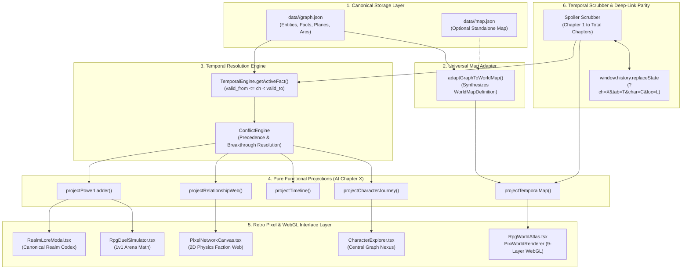
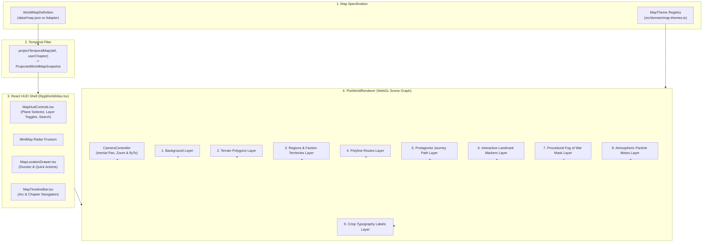

# OmniLore System Architecture & Technical Specification

> **System:** OmniLore (Temporal Knowledge Graph & Spoiler-Free World Explorer)  
> **Status:** Active Production Specification  
> **Version:** 2.0  
> **Repository:** `omni-lore`  

---

## 🏛️ 1. Architecture Overview

OmniLore decouples raw canonical lore storage from point-in-time visual presentation through a **Pure Functional Projection Pipeline**:



---

## 📐 2. Canonical Lore Graph Schema

Every universe is modeled as a directed, temporal multigraph serialized to `data/<slug>/graph.json`.

### 2.1 Core Types (`src/domain/types.ts`)

```typescript
export interface CanonicalLoreGraph {
  series: SeriesMetadata;
  power_system: PowerSystem;
  entities: Record<string, Entity>;       // Characters, Factions, Locations, Items
  facts: Record<string, Fact>;             // Temporal point-in-time attributes
  planes: Plane[];                         // Cosmological spatial planes
  arcs: Arc[];                             // Chronological narrative arcs
}
```

### 2.2 Entities
Entities represent persistent objects in the universe.
* **CharacterEntity:** `id`, `name`, `aliases`, `first_appearance`, `avatar_url`, `description`.
* **FactionEntity:** `id`, `name`, `leader_id`, `emblem_url`, `description`, `color`.
* **LocationEntity:** `id`, `name`, `plane_id`, `coordinates: { x, y }`, `first_appearance`, `danger_level`.
* **ItemEntity:** `id`, `name`, `type: 'artifact' | 'weapon' | 'pill'`, `first_appearance`.

### 2.3 Facts (The Temporal Unit)
Instead of mutating character attributes, state changes are stored as append-only **temporal facts**:
```typescript
export interface Fact<T = any> {
  id: string;
  subject_id: string;            // e.g. "linley-baruch"
  predicate: string;             // "stage" | "faction" | "location" | "status" | "relationship"
  value: T;                      // Target value or related entity ID
  valid_from: number;            // Beginning chapter of validity
  valid_to?: number;             // Chapter when this fact was superseded (null if current)
  metadata?: Record<string, any>;// e.g. relationship label ("Master", "Rival")
}
```

---

## ⏱️ 3. Temporal Resolution & Conflict Handling

### 3.1 Point-in-Time Active Fact Resolution
For any entity and predicate, the active fact at `userChapter` is resolved via:
```typescript
export class TemporalEngine {
  static getActiveFact<T>(
    subjectId: string,
    predicate: string,
    facts: Fact[],
    userChapter: number
  ): Fact<T> | null {
    const matching = facts.filter((f) =>
      f.subject_id === subjectId &&
      f.predicate === predicate &&
      f.valid_from <= userChapter &&
      (f.valid_to === undefined || f.valid_to === null || f.valid_to > userChapter)
    );

    if (matching.length === 0) return null;
    if (matching.length === 1) return matching[0];

    // Conflict resolution: highest valid_from wins (latest canonical breakthrough)
    return matching.sort((a, b) => b.valid_from - a.valid_from)[0];
  }
}
```

### 3.2 Secret Identity Masking
When a character operates under an alias (e.g. Klein Moretti as *Sherlock Moriarty* or *Gehrman Sparrow*):
1. The projection engine checks whether `userChapter >= unmask_chapter`.
2. If before the unmask chapter, `displayName` resolves to the current active alias and `isMasked = true`.
3. In the UI, masked characters display with the `[UNKNOWN ENIGMA]` badge and an `EyeOff` indicator to prevent identity spoilers.

---

## 🚀 4. Pure Functional Projection Pipelines

All projections reside in [`src/projections/`](file:///Users/deepaknaik/Downloads/world-building/omni-lore/src/projections/) and operate deterministically:

### 4.1 Power Ladder Projection (`power-ladder.ts`)
- Evaluates each character's active `stage` fact at `userChapter`.
- Groups characters into ordered tiers (`T1` to `TN`).
- Highlights recent breakthroughs (`achieved_at_chapter === userChapter`).
- Exposes full codex metadata (advancement criteria, phenomena, mortality risks).

### 4.2 Relationship & Faction Web Projection (`relationship-web.ts`)
- Gathers active `relationship` facts where `valid_from <= userChapter < valid_to`.
- Filters out nodes whose `first_appearance > userChapter`.
- Categorizes edges into: `ally`, `master`, `disciple`, `rival`, `enemy`, `family`, `faction`.
- Generates 2D force simulation nodes and edges for [`PixelNetworkCanvas.tsx`](file:///Users/deepaknaik/Downloads/world-building/omni-lore/src/components/pixel/PixelNetworkCanvas.tsx).

### 4.3 World Map & Temporal Cartography Projections (`temporal-map.ts` & `map-adapter.ts`)
- [`projectTemporalMap()`](file:///Users/deepaknaik/Downloads/world-building/omni-lore/src/projections/temporal-map.ts): Pure functional projection taking a [`WorldMapDefinition`](file:///Users/deepaknaik/Downloads/world-building/omni-lore/src/domain/map-types.ts) and `userChapter`, outputting an immutable [`ProjectedWorldMapSnapshot`](file:///Users/deepaknaik/Downloads/world-building/omni-lore/src/projections/temporal-map.ts).
  - Filters locations strictly by `discovery_chapter <= userChapter`.
  - Determines Fog of War status (`discovered`, `visible_in_fog`, `hidden`) with dynamic clearing apertures (landmarks: 105px, active character posts: 125px, travel routes: 80px).
  - Evaluates active controlling factions at `userChapter` across all territorial spheres.
  - Slices protagonist journey waypoints and routes up to the reader's current chapter.
  - Filters spatial historical events strictly prior to `userChapter`.
- [`adaptGraphToWorldMap()`](file:///Users/deepaknaik/Downloads/world-building/omni-lore/src/projections/map-adapter.ts): Universal fallback projection ensuring zero breaking changes for graphs without a bespoke `map.json`.
  - Synthesizes Zod-validated map definitions dynamically from `LocationEntity`, `PlaneEntity`, `EventEntity`, and temporal character facts.
  - Inferred location types, auto-generated bounding box regions, chronologically linked voyage routes, and territorial influence spheres.

### 4.4 Story Timeline Projection (`timeline.ts`)
- Returns narrative arcs active or completed by `userChapter`.
- Filters events strictly to `event.chapter <= userChapter`.
- Categorizes events into `battle`, `breakthrough`, `political`, `discovery`, `tragedy`.

### 4.5 Character Journey Projection (`character-journey.ts`)
- Generates a complete stepped progression line of power stages (past achieved, current, and locked future stages).
- Aggregates categorized relationships, visited geographic footprint, and chronological milestones.

---

## 🗺️ 5. Map Engine v2 & PixiJS Cartography Architecture

OmniLore Map Engine v2 replaces static SVG maps with a high-performance, WebGL-accelerated 2D interactive atlas capable of rendering multi-plane cosmologies, real-time fog of war, and procedural atmospheric effects:



### 5.1 PixiWorldRenderer Engine ([`pixi-world-renderer.ts`](file:///Users/deepaknaik/Downloads/world-building/omni-lore/src/engine/map/pixi-world-renderer.ts))
- **WebGL 2D Hardware Acceleration:** Utilizes PixiJS v8 `Application` rendering directly to an HTML5 canvas with automated ticker loops.
- **Client-Side & SSR Safety:** Safely isolates WebGL browser operations, executing cleanly in headless / test / SSR environments without throwing canvas errors.
- **GPU Resource Management:** Implements comprehensive disposal routines (`clearAllContainers()`, `destroy()`, geometry vertex cleanup) to prevent memory leaks during rapid universe and plane switching.
- **Interactive Event Dispatch:** Direct pointer listeners on landmarks and event glyphs with hover state scaling, outer pulse rings, and click-to-focus callbacks.

### 5.2 9-Layer Isolated Scene Graph
The engine structures visual elements into 9 independently toggled, z-indexed PixiJS `Container` nodes:
1. `backgroundContainer`: Deep space / map boundary framing, coordinate grid lines, and cosmological plane backdrop.
2. `terrainContainer`: Geometric vector polygons representing mountain ranges, lakes, abysses, and elevation tiers.
3. `regionsContainer`: Faction territorial spheres and political borders shaded with universe brand colors and dynamic alpha fills.
4. `routesContainer`: Trade caravans, maritime sea lanes, and imperial corridors with animated dashing effects.
5. `characterPathContainer`: Active protagonist journey polyline showing visited waypoints up to `userChapter`.
6. `markersContainer`: Multi-shape interactive pins (diamonds, circles, skulls) scaled by location importance (Hub, Outpost, Danger zone).
7. `fogContainer`: Procedural circular apertures unmasking discovered landmarks and routes while shrouding uncharted sectors in atmospheric dithered fog.
8. `atmosphereContainer`: Ambient particle systems tailored per universe (ink mist for Reverend Insanity, purple cosmic motes for Lord of the Mysteries, wind embers for Coiling Dragon).
9. `labelsContainer`: Crisp typography labels with automatic level-of-detail (LOD) threshold scaling to avoid visual clutter during wide zoom-outs.

### 5.3 CameraController & Viewport Kinematics ([`camera-controller.ts`](file:///Users/deepaknaik/Downloads/world-building/omni-lore/src/engine/map/camera-controller.ts))
- **Kinematic Navigation:** Smooth pan, drag, and pinch-to-zoom (0.3x to 4.0x) with velocity-based inertia and boundary clamping.
- **Animated `flyTo()`:** Smooth camera panning with cubic easing to smoothly center on clicked landmarks, character waypoints, or search results.
- **Frustum Sync:** Computes current viewport bounding box in real time, projecting camera bounds onto the mini-map radar widget.

### 5.4 RpgWorldAtlas Component & Retro HUD ([`RpgWorldAtlas.tsx`](file:///Users/deepaknaik/Downloads/world-building/omni-lore/src/components/map/RpgWorldAtlas.tsx))
- **Integrated HUD Suite:**
  - [`MapHudControls.tsx`](file:///Users/deepaknaik/Downloads/world-building/omni-lore/src/components/map/MapHudControls.tsx): Plane selection buttons, layer visibility toggles (`TERRAIN`, `FACTIONS`, `ROUTES`, `FOG`, `PARTICLES`), search filter, and camera reset.
  - **MiniMap Radar:** Pixelated world overview showing real-time camera frustum rectangle.
  - [`MapLocationDrawer.tsx`](file:///Users/deepaknaik/Downloads/world-building/omni-lore/src/components/map/MapLocationDrawer.tsx): Retro slide-over dossier showing danger rating, controlling faction, canon events, and direct cross-tab actions ("SHOW IN JOURNEY", "DUEL HERE").
  - [`MapTimelineBar.tsx`](file:///Users/deepaknaik/Downloads/world-building/omni-lore/src/components/map/MapTimelineBar.tsx): Story arc markers and temporal chapter scrubber synchronized directly with global URL parameters.

### 5.5 Multi-Universe MapTheme Registry ([`map-themes.ts`](file:///Users/deepaknaik/Downloads/world-building/omni-lore/src/domain/map-themes.ts))
A centralized palette and shader registry tailoring aesthetic parameters to each cosmos:
- **Reverend Insanity:** Obsidian-jade backdrop (`#0a1712`), emerald accents (`#10b981`), crimson danger highlights, ink mist fog, and floating Gu essence motes.
- **Lord of the Mysteries:** Abyssal violet backdrop (`#0d0b1a`), mystical purple borders, fog of Victorian occult smog, and celestial starlight motes.
- **Coiling Dragon:** Warm earthly amber (`#1a1409`), fiery magma trails, golden divine glow, and elemental essence motes.
- **Demonic Emperor:** Dark indigo / blood shadow palette (`#0f0a1c`), demonic qi haze, and soul flame particles.
- **Solo Leveling:** Neon hunter blue (`#04111f`), dark portal rift shadows, and azure monarch mana motes.
- **One Piece:** Grand Line nautical parchment / deep ocean navy (`#071926`), gold compass borders, and sea foam particles.

### 5.6 Universal Map Fallback Adapter ([`map-adapter.ts`](file:///Users/deepaknaik/Downloads/world-building/omni-lore/src/projections/map-adapter.ts))
Ensures seamless 100% backward compatibility for existing universes:
- Reads `data/<slug>/map.json` if available (e.g. Reverend Insanity).
- If unavailable, `adaptGraphToWorldMap(graph)` synthesizes a complete, Zod-validated `WorldMapDefinition` directly from canonical graph entities on the fly, calculating bounding box planes, inferring terrain biomes, connecting event waypoints into trade routes, and projecting faction influence polygons.

---

## ⚔️ 6. RPG Duel Simulator Engine

The Duel Simulator ([`duel-simulator.ts`](file:///Users/deepaknaik/Downloads/world-building/omni-lore/src/engine/duel-simulator.ts)) calculates dynamic battle outcomes based on characters' temporal power at `userChapter`:

$$P = \text{BasePower} \times (\text{RealmMultiplier})^{\text{tier}} \times (1 + \text{BreakthroughBonus}) \times \text{AffiliationBonus}$$

- **Turn Resolution:** Multi-round turn-based combat simulation calculating offensive strikes, barrier mitigations, and critical breakthroughs.
- **Narrative Log:** Produces authentic retro battle commentary ("Linley channels Baruch Dragonblood armor!").
- **Audio Feedback:** Synthesizes combat sound effects via Web Audio API.

---

## 🔗 7. URL State & Deep Linking Parity

To enable snapshot sharing, bookmarking, and instant state restoration:
- **URL Schema:** `/[slug]?ch=<number>&tab=<tab_name>&char=<character_id>&loc=<location_id>`
- **Mount Hydration:** Reads URL params on initial load to set `userChapter`, `activeTab`, `selectedCharacterId`, and `selectedLocationId`.
- **State Synchronization:** Uses `window.history.replaceState` in a `useEffect` hook to update the browser URL bar in real-time as the slider moves without triggering Next.js server re-renders.
- **Share Snapshot:** Copies full stateful URL to clipboard with feedback toast.

---

## 🧩 8. OmniLore Reader — Chrome Extension Architecture

The OmniLore Reader Chrome Extension (`chrome-extension/`) operates as a lightweight, zero-latency reader companion directly inside modern manga, manhwa, and web novel reading platforms:

```text
                    ┌──────────────────────┐
                    │     WEBTOON / NOVEL  │
                    │     MANGA READER     │
                    └──────────┬───────────┘
                               │
                       Chapter Detection (DOM & URL)
                               │
                               ▼
                    ┌──────────────────────┐
                    │  OMNILORE EXTENSION  │
                    │      SIDE PANEL      │
                    └──────────┬───────────┘
                               │
                    series + chapter + context
                               │
                               ▼
                    ┌──────────────────────┐
                    │ Extension Temporal   │
                    │   Client (Offline)   │
                    │                      │
                    │  "What is known      │
                    │   at Chapter 147?"   │
                    └──────────┬───────────┘
                               │
                 ┌─────────────┼─────────────┐
                 ▼             ▼             ▼
             Character      Secrets       Power
              Roster       / Events       Ranking
                 │             │             │
                 └─────────────┼─────────────┘
                               ▼
                    ┌──────────────────────┐
                    │   GAME-HUD SIDEPANEL │
                    ├──────────────────────┤
                    │ Chapter 147          │
                    │ 🛡️ Shield: SAFE      │
                    │                      │
                    │ 👤 Characters        │
                    │ ⚡ Power Ladder      │
                    │ 🔐 Secrets           │
                    │ 🕸 Relationships     │
                    │ ⚔ Duel (Simulated)   │
                    │ 💬 Ask Chapter       │
                    └──────────────────────┘
```

1. **Manifest V3 Ephemeral Background Worker (`background/service-worker.ts`):**
   - Configured with `chrome.sidePanel.setPanelBehavior({ openPanelOnActionClick: true })` for native one-click side panel access.
   - Preserves tab reading state in `chrome.storage.session`.
   - Listens to context menu clicks (`"OmniLore: Who is '%s'?"`) to trigger instant zero-spoiler character lookups without switching tabs.
2. **Active Chapter Detectors (`content/detectors/`):**
   - Pluggable adapter architecture (`mangaplus.ts`, `webnovel.ts`, `wuxiaworld.ts`, `tapas.ts`, `generic.ts`).
   - Evaluates page URL pathnames, title tags, and reader viewer headers to extract `{ seriesTitle, seriesSlug, chapterNumber, confidence }`.
3. **100% Offline Temporal Engine Client (`temporal/temporal-client.ts`):**
   - Bundles all 5 normalized universe lore graphs (~790 KB total) into the client bundle.
   - Evaluates point-in-time entity debuts, power stage breakthroughs, active factions, and identity unmasking on the fly.
4. **Retro Game-HUD Side Panel (`sidepanel/app.tsx`):**
   - **Spoiler Shield Selector:** 3 selectable shield levels (`🛡️ SAFE`, `⚠️ CONTEXT`, `🔥 FULL`).
   - **Mini RPG Duel Simulator:** Simulates turn-based battles at exact chapter parity with the mandatory disclaimer: *"Simulation — not canon"*.
   - **Grounded Chapter Oracle:** Answers questions strictly grounded in temporal graph facts revealed up to the reader's current chapter.

---

## 🧪 9. Quality & Verification Standards

1. **Automated Testing:**
   All 16 test suites (115 unit tests) run in under 700ms using Vitest:
   - [`tests/temporal-engine.test.ts`](file:///Users/deepaknaik/Downloads/world-building/omni-lore/tests/temporal-engine.test.ts): Fact intervals, masking, temporal boundary enforcement.
   - [`tests/conflict-engine.test.ts`](file:///Users/deepaknaik/Downloads/world-building/omni-lore/tests/conflict-engine.test.ts): Priority tie-breaking and latest breakthrough prioritization.
   - [`tests/projections.test.ts`](file:///Users/deepaknaik/Downloads/world-building/omni-lore/tests/projections.test.ts): Ladder, web, map, timeline, and journey transforms.
   - [`tests/duel-simulator.test.ts`](file:///Users/deepaknaik/Downloads/world-building/omni-lore/tests/duel-simulator.test.ts): Battle formula and scaling calculations.
   - [`tests/sound-effects.test.ts`](file:///Users/deepaknaik/Downloads/world-building/omni-lore/tests/sound-effects.test.ts): Audio synthesizer safety and mute toggling.
   - [`tests/pixel-converter.test.ts`](file:///Users/deepaknaik/Downloads/world-building/omni-lore/tests/pixel-converter.test.ts): Procedural SVG pixelation algorithms.
   - [`tests/datastore.test.ts`](file:///Users/deepaknaik/Downloads/world-building/omni-lore/tests/datastore.test.ts): Canonical graph schema validation across all universes.
   - [`tests/user-progress.test.ts`](file:///Users/deepaknaik/Downloads/world-building/omni-lore/tests/user-progress.test.ts): Progress persistence, chapter nudges, and bookmarking.
   - [`tests/map-schema.test.ts`](file:///Users/deepaknaik/Downloads/world-building/omni-lore/tests/map-schema.test.ts): Zod validation for WorldMapDefinition, regions, routes, and layers.
   - [`tests/temporal-map.test.ts`](file:///Users/deepaknaik/Downloads/world-building/omni-lore/tests/temporal-map.test.ts): Zero-spoiler map projection, fog status, and aperture calculations.
   - [`tests/map-themes.test.ts`](file:///Users/deepaknaik/Downloads/world-building/omni-lore/tests/map-themes.test.ts): Theme registry token validation and fallback defaults.
   - [`tests/pixi-renderer.test.ts`](file:///Users/deepaknaik/Downloads/world-building/omni-lore/tests/pixi-renderer.test.ts): 9-layer scene graph, CameraController physics, and GPU memory cleanup.
   - [`tests/rpg-atlas-component.test.ts`](file:///Users/deepaknaik/Downloads/world-building/omni-lore/tests/rpg-atlas-component.test.ts): RpgWorldAtlas React HUD controls, plane switching, and search filtering.
   - [`tests/reverend-insanity.test.ts`](file:///Users/deepaknaik/Downloads/world-building/omni-lore/tests/reverend-insanity.test.ts): Reverend Insanity graph integrity, 9-tier Gu power system, 3 planes, and persona unmasking.
   - [`tests/map-adapter.test.ts`](file:///Users/deepaknaik/Downloads/world-building/omni-lore/tests/map-adapter.test.ts): Universal graph-to-map fallback synthesis across legacy universes.
   - [`tests/extension.test.ts`](file:///Users/deepaknaik/Downloads/world-building/omni-lore/tests/extension.test.ts): Reader detector adapters, title normalization, temporal snapshots, and mini-duels.
2. **Build Integrity:**
   - Web App: `npm run build` compiles clean static and dynamic routes with Next.js Turbopack.
   - Chrome Extension: `npm run build:extension` compiles unpacked bundles into `chrome-extension/dist` with `esbuild`.

