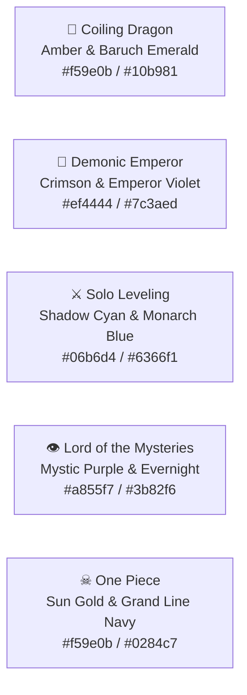

# OmniLore Design System & Aesthetic Specification

> **Aesthetic:** Modern Pixel Fantasy Atlas & Retro Operating System  
> **Status:** Production Specification  
> **Version:** 2.0  

---

## 🎨 1. Aesthetic Vision & Atmosphere

OmniLore delivers the tactile nostalgia of 16-bit / 32-bit fantasy RPGs (SNES, Game Boy Advance, PS1) merged with the responsiveness of modern web software:
- **Scanlines & CRT Vignettes:** Subtle scanline textures and radial vignettes that frame character portraits, status sheets, and map viewports.
- **Pixel-Accurate Sprites:** Vector SVG and pixel art rendered with `[image-rendering:pixelated]`.
- **Dithered Shrouds:** Authentic 8-bit dither patterns for the Fog of War, simulating classic world map exploration.
- **Chiptune Audio Feedback:** Real-time synthesized 8-bit sound effects (bleeps, fanfares, warp swooshes) using the Web Audio API.

---

## 🔤 2. Typography & Fonts

| Font Category | CSS Class | Usage | Visual Feel |
| :--- | :--- | :--- | :--- |
| **Pixel Header** | `font-pixel` (Silkscreen) | Titles, arc banners, badges, realm codes, buttons | Crisp 8-bit retro arcade |
| **Mono Data** | `font-mono` (Geist Mono / Courier) | Chapter numbers, coordinates, battle logs, stats | Technical lore terminal |
| **Body Text** | `font-sans` (Geist Sans / Inter) | Long biographies, event descriptions, lore synopses | Clean, readable narrative |

---

## 🌈 3. Universe Color Palettes & Runes

Each universe has an authentic thematic palette and sacred rune:

### 3.1 Universe Configuration (`src/domain/themes.ts`)

| Universe | Rune | Accent Border | Badge Background | Badge Text | Thematic Focus |
| :--- | :---: | :--- | :--- | :--- | :--- |
| **Coiling Dragon** | 🐉 | `border-amber-500/40` | `bg-amber-950/40` | `text-amber-300` | Golden Dragonblood & Elemental Laws |
| **Demonic Emperor** | 🦅 | `border-purple-500/40` | `bg-purple-950/40` | `text-purple-300` | Sovereign Rebirth & Demonic Schemes |
| **Solo Leveling** | ⚔ | `border-cyan-500/40` | `bg-cyan-950/40` | `text-cyan-300` | Cyber Hunter System & Shadow Extraction |
| **Lord of the Mysteries** | 👁 | `border-indigo-500/40` | `bg-indigo-950/40` | `text-indigo-300` | Victorian Beyonder Potions & Occult Mist |
| **One Piece** | ☠ | `border-rose-500/40` | `bg-rose-950/40` | `text-rose-300` | Sea Voyage, Haki & Devil Fruits |

---

## 🧩 4. Core Pixel Components

### 4.1 `PixelAvatar` (`src/components/pixel/PixelAvatar.tsx`)
- Framed in an authentic scanline border with subtle outer glow.
- Renders pixel art SVGs or initials with fallback retro icons.
- If `isMasked === true`, applies an occult silhouette with `EyeOff` and `[UNKNOWN ENIGMA]` badge.

### 4.2 `PixelGauge` (`src/components/pixel/PixelGauge.tsx`)
- Segmented retro progress bar displaying completion metrics (`Fog of War Lifted`, `Power Progression`).
- Uses custom color classes (`text-amber-400`, `text-cyan-400`, `text-purple-400`).

### 4.3 `CharacterExplorer` (`src/components/pixel/CharacterExplorer.tsx`)
- **Vitals HUD:** Scanline portrait, realm tier, active faction, current location, and masked status.
- **Stepped Power Rail:** Horizontal stepped line (`Mortal ── Saint ── God ── Highgod ── Sovereign`) with chapter badges.
- **Relationship Matrix:** Category badges:
  - Brother / Sworn: `border-amber-400/50 bg-amber-950/40 text-amber-300`
  - Crew / Member: `border-emerald-400/50 bg-emerald-950/40 text-emerald-300`
  - Alliance: `border-cyan-400/50 bg-cyan-950/40 text-cyan-300`
  - Rival / Enemy: `border-rose-400/50 bg-rose-950/40 text-rose-300`
  - Mentor / Master: `border-purple-400/50 bg-purple-950/40 text-purple-300`

### 4.4 `PixelMapCanvas` (`src/components/pixel/PixelMapCanvas.tsx`)
- **Controls:** Pan, drag, zoom (`0.75x` to `2.5x`), center on landmark, and fog toggle.
- Superseded as the primary atlas by the Level-Select Tileset Atlas (`RpgWorldAtlas.tsx`, PixiJS-rendered) — see § 6 below for its fog, tileset and marker treatment.

---

## 🔊 5. 8-Bit Audio Synthesis (`src/lib/sound-effects.ts`)

OmniLore includes a built-in sound engine requiring zero external audio assets, using real-time Web Audio API frequency synthesis:

| Sound Function | Audio Pattern | Typical Trigger |
| :--- | :--- | :--- |
| `playMenuSelect()` | 2-tone ascending square wave (440Hz $\rightarrow$ 880Hz, 80ms) | Tab switch, character pick |
| `playScrubberTick()` | Subtle high-frequency click (1200Hz, 20ms) | Chapter slider scrub |
| `playBreakthroughFanfare()` | 4-tone ascending major arpeggio (C5-E5-G5-C6) | Realm breakthrough, codex open |
| `playBattleStrike()` | Dual-frequency low punch with noise decay | Duel arena round attack |
| `playPlaneWarp()` | Descending sweep (900Hz $\rightarrow$ 200Hz, 250ms) | Switching cosmological planes |

### Audio Safety Rules
- Audio is muted by default on first visit or initial render until user interaction.
- Mute state persists across tabs and is toggled via `[ SFX: ON / OFF ]` button in the header bar.

---

## 🗺️ 6. Level-Select Tileset Atlas

The world atlas (`RpgWorldAtlas.tsx`, PixiJS-rendered) composes each plane from licensed 16px tilesets on a baked Canvas 2D layer, in the style of a Diablo-esque "LEVEL SELECT / WORLD 1" screen: textured grass, dense tree clumps, snowy mountain ranges, shaded coastal water, winding dirt paths and numbered stage nodes inside an ornate pixel frame.

### 6.1 Art sources & licenses
| Sheet | File | License | Use |
| :--- | :--- | :--- | :--- |
| Puny World overworld tileset (Shade) | `public/assets/tilesets/punyworld/punyworld-overworld-tileset.png` | **CC0 1.0** | grass, conifers, round trees, palms, rocks, castles, halls, houses, cave |
| Worldmap mountains (MrBeast, commissioned by OpenGameArt.org) | `public/assets/tilesets/oga-worldmap/mountains.png` | **CC-BY 3.0** | grey and snow mountain peaks |

Both sheets are credited in [`CREDITS.md`](file:///Users/deepaknaik/Downloads/world-building/omni-lore/CREDITS.md) at the repo root. Because the MrBeast sheet is CC-BY, attribution is also always on screen: `AtlasFrame.tsx` renders a small "Art:" credit line with links to both source pages in the bottom-left corner of every atlas view.

### 6.2 Scale
- Baked plane texture: **0.5 px per world unit** (16 px tile = 32 world units), giving the reference's chunky, readable proportions. Displayed at 2×.
- Live-layer tileset sprites (markers/props) use the same sheets at **scale 2** (world units per sheet pixel) so baked terrain and live props match pixel-for-pixel.
- All scale factors are kept integer so PixiJS nearest-neighbor filtering stays crisp at every zoom level.

### 6.3 Paint order
Each plane is painted once (cached per `mapId:planeId:universe`) in this fixed order, so later strokes never get buried under earlier fills:
1. **Backdrop** — sea/sky/abyss/void/river base color, deep-water blobs, wave glints (water backdrops); cloud rim (sky); drop shadow (abyss/void).
2. **Coast shelf → shallows → foam / sand rim** — layered bands around every landmass (shelf 14px, shallows 7px, sand rim 3px, 1px foam line), traced along coastlines roughened by seeded fractal midpoint displacement so even rectangular source polygons read as organic coastline.
3. **Ground fills** — grass tile pattern, sand, snow, ash, bog, voidstone, by terrain type.
4. **Patches** — darker grass tone patches, forest/lone tree clumps, mountain peaks (35% snow variant), desert rocks, oasis palms; seeded value-noise + jittered grids, y-sorted so canopies overlap correctly.
5. **Rivers** — stroked ribbons across the ground fills.
6. **Bridges** — drawn at recorded crossing points over rivers.
7. **Stamps** — the same tree/peak/rock/palm sprites drawn as discrete Puny World / mountain-sheet cutouts (peaks clipped to a triangle silhouette with a 1px outline).
8. **Universe grade** — a pure per-pixel color grade (`gradePixels`) applied once over the finished raster.

### 6.4 Per-universe look (`UNIVERSE_LOOKS`)
Each universe tints the shared tileset palette and sets its own fog mood:

| Universe | Tint / amount / saturation | Fog color | Fog opacity |
| :--- | :--- | :--- | :--- |
| reverend-insanity | `#14966e` / 0.12 / 0.90 | `#dfeee6` | 0.62 |
| lord-of-the-mysteries | `#503282` / 0.22 / 0.60 | `#cfc8dc` | 0.62 |
| coiling-dragon | `#f0a030` / 0.08 / 1.05 | `#f2eadb` | 0.62 |
| demonic-emperor | `#8a1830` / 0.16 / 0.75 | `#d8c8cc` | 0.62 |
| one-piece | `#1080d0` / 0.05 / 1.10 | `#e8f2fa` | 0.62 |
| solo-leveling | `#102850` / 0.25 / 0.70 | `#b8c4d8` | 0.70 |

Fog is a soft, light cloud color per universe, never black — every look keeps `fogOpacity` between 0.4 and 0.7 (lowered from an earlier near-opaque 0.94–0.96 range after in-browser review: at full fog only about half the dither cells paint, so the baked terrain reads through instead of vanishing under a cream-white shroud).

### 6.5 Markers, clearings, silhouettes, badges
- **Tileset props by location type:** city → castle, castle → red castle, sect/temple → teal hall, clan/village → house, dungeon/cave/mountain → cave.
- **Code-drawn fallback icons** cover everything the sheets don't have: battlefield, portal, landmark, ruin, ocean, island, lake, plus landmark glyphs (volcano, spire, crater, …) and the waypoint pylon — all baked once per theme into cached textures (`icon-atlas.ts`).
- **Grass clearings:** every *visible* marker draws its own grass-tone clearing ellipse under itself at render time. There is no bake-time clearing around locations — that would betray where an undiscovered location sits before the story reveals it.
- **KNOWN (undiscovered) silhouettes:** prop tinted to a dark, flat silhouette at 70% alpha, no pylon, no badge; hovering shows `??? UNCHARTED` instead of a name.
- **Numbered journey badges:** gold square badges numbered by the order the active character first visited each location on the current plane (`journey-numbers.ts`), shown only for visits at or before the current chapter.
- **`DANGER_COLORS`:** `EX #dc2626`, `S #f97316`, `A #f59e0b`, `B #64748b`, `Safe #10b981` — used for tooltip danger badges and marker accents.

### 6.6 Roads, hero trail & fog
- **Dirt-path roads:** the reference's packed-earth look — dark brown edge (`#6e4824`) with a tan/gold center fill (`#d4a860` roads, `#e0b86a` the hero's own trail), no animated dashing (unlike sea lanes/flight arcs, which keep the v1 pixel-dash style).
- **Light dithered cloud fog:** a Bayer-4 ordered-dither pattern rendered as a world-anchored Pixi `Mesh` shader (`fog-material.ts`), not a screen-space filter, so the dither cells and drifting noise stay locked to the map at every zoom/pan. Circular apertures (critical landmarks 70px, other locations 45px, waypoints 50px) punch through the fog around discovered content; unopened cells stay in the classic 4×4 Bayer matrix, at the lowered opacity in § 6.4.

### 6.7 HUD chrome
- **Tooltip** (`AtlasTooltip.tsx`): type, danger color, controlling faction, first-seen chapter; `??? UNCHARTED` for KNOWN locations.
- **Discovery banner** (`DiscoveryBanner.tsx`): "NEW AREA DISCOVERED" pixel banner that coalesces rapid reveals into a single `+N MORE` line instead of stacking.
- **Waypoint panel** (`WaypointPanel.tsx`, `M` key): travel list grouped by plane; sealed (unrevealed) planes show `??? SEALED REALM` and are not selectable.
- **Frame** (`AtlasFrame.tsx`): ornate pixel border with universe-rune corners and the CC-BY "Art:" credit links.
- **Minimap** (`AtlasMinimap.tsx`): pixelated world overview with the live camera frustum rectangle.

### 6.8 Reduced motion
`prefers-reduced-motion: reduce` (detected once on mount, `RpgWorldAtlas.tsx`) disables: the hero's walking animation and torch bob (hero snaps directly to position), fog drift and reveal-burst particles, the warp spiral on plane travel, discovery-burst sparks, ambient atmosphere particles/cloud drift, and route dash animation. `flyTo()` camera moves also collapse to a near-instant 16ms instead of an eased tween.
