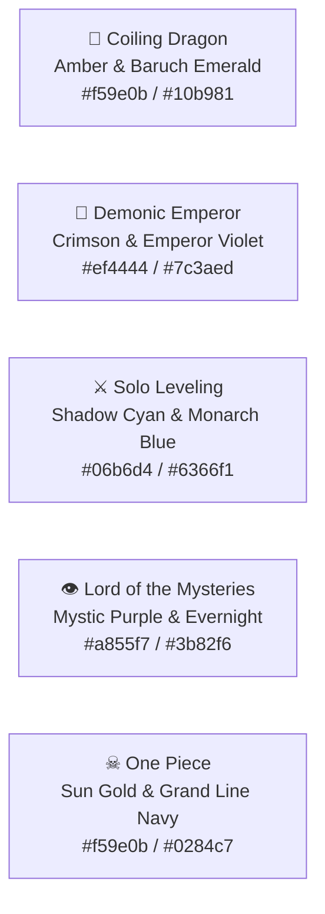

# OmniLore Design System & Aesthetic Specification

> **Aesthetic:** Modern Pixel Fantasy Atlas & Retro Operating System  
> **Status:** Production Specification  
> **Version:** 2.0  

---

## 🎨 1. Aesthetic Vision & Atmosphere

OmniLore delivers the tactile nostalgia of 16-bit / 32-bit fantasy RPGs (SNES, Game Boy Advance, PS1) merged with the responsiveness of modern web software:
- **Scanlines & CRT Vignettes:** Subtle scanline textures and radial vignettes that frame character portraits, status sheets, and map viewports.
- **Pixel-Accurate Sprites:** Vector SVG and pixel art rendered with `[image-rendering:pixelated]`.
- **Dithered Shrouds:** Authentic 8-bit dither patterns for the Fog of War, simulating classic world map exploration.
- **Chiptune Audio Feedback:** Real-time synthesized 8-bit sound effects (bleeps, fanfares, warp swooshes) using the Web Audio API.

---

## 🔤 2. Typography & Fonts

| Font Category | CSS Class | Usage | Visual Feel |
| :--- | :--- | :--- | :--- |
| **Pixel Header** | `font-pixel` (Silkscreen) | Titles, arc banners, badges, realm codes, buttons | Crisp 8-bit retro arcade |
| **Mono Data** | `font-mono` (Geist Mono / Courier) | Chapter numbers, coordinates, battle logs, stats | Technical lore terminal |
| **Body Text** | `font-sans` (Geist Sans / Inter) | Long biographies, event descriptions, lore synopses | Clean, readable narrative |

---

## 🌈 3. Universe Color Palettes & Runes

Each universe has an authentic thematic palette and sacred rune:

### 3.1 Universe Configuration (`src/domain/themes.ts`)

| Universe | Rune | Accent Border | Badge Background | Badge Text | Thematic Focus |
| :--- | :---: | :--- | :--- | :--- | :--- |
| **Coiling Dragon** | 🐉 | `border-amber-500/40` | `bg-amber-950/40` | `text-amber-300` | Golden Dragonblood & Elemental Laws |
| **Demonic Emperor** | 🦅 | `border-purple-500/40` | `bg-purple-950/40` | `text-purple-300` | Sovereign Rebirth & Demonic Schemes |
| **Solo Leveling** | ⚔ | `border-cyan-500/40` | `bg-cyan-950/40` | `text-cyan-300` | Cyber Hunter System & Shadow Extraction |
| **Lord of the Mysteries** | 👁 | `border-indigo-500/40` | `bg-indigo-950/40` | `text-indigo-300` | Victorian Beyonder Potions & Occult Mist |
| **One Piece** | ☠ | `border-rose-500/40` | `bg-rose-950/40` | `text-rose-300` | Sea Voyage, Haki & Devil Fruits |

---

## 🧩 4. Core Pixel Components

### 4.1 `PixelAvatar` (`src/components/pixel/PixelAvatar.tsx`)
- Framed in an authentic scanline border with subtle outer glow.
- Renders pixel art SVGs or initials with fallback retro icons.
- If `isMasked === true`, applies an occult silhouette with `EyeOff` and `[UNKNOWN ENIGMA]` badge.

### 4.2 `PixelGauge` (`src/components/pixel/PixelGauge.tsx`)
- Segmented retro progress bar displaying completion metrics (`Fog of War Lifted`, `Power Progression`).
- Uses custom color classes (`text-amber-400`, `text-cyan-400`, `text-purple-400`).

### 4.3 `CharacterExplorer` (`src/components/pixel/CharacterExplorer.tsx`)
- **Vitals HUD:** Scanline portrait, realm tier, active faction, current location, and masked status.
- **Stepped Power Rail:** Horizontal stepped line (`Mortal ── Saint ── God ── Highgod ── Sovereign`) with chapter badges.
- **Relationship Matrix:** Category badges:
  - Brother / Sworn: `border-amber-400/50 bg-amber-950/40 text-amber-300`
  - Crew / Member: `border-emerald-400/50 bg-emerald-950/40 text-emerald-300`
  - Alliance: `border-cyan-400/50 bg-cyan-950/40 text-cyan-300`
  - Rival / Enemy: `border-rose-400/50 bg-rose-950/40 text-rose-300`
  - Mentor / Master: `border-purple-400/50 bg-purple-950/40 text-purple-300`

### 4.4 `PixelMapCanvas` (`src/components/pixel/PixelMapCanvas.tsx`)
- **Fog of War Shroud:** SVG `<mask id="fog-of-war-mask">` with `<feGaussianBlur stdDeviation="12">`.
- **Apertures:** Punches circular holes (`r=105px`) at discovered landmarks, a voyage route corridor (`80px`), and active station perimeter (`125px`).
- **Dither Pattern:** SVG `<pattern id="retro-fog-dither">` with alternating pixel blocks.
- **Controls:** Pan, drag, zoom (`0.75x` to `2.5x`), center on landmark, and fog toggle.

---

## 🔊 5. 8-Bit Audio Synthesis (`src/lib/sound-effects.ts`)

OmniLore includes a built-in sound engine requiring zero external audio assets, using real-time Web Audio API frequency synthesis:

| Sound Function | Audio Pattern | Typical Trigger |
| :--- | :--- | :--- |
| `playMenuSelect()` | 2-tone ascending square wave (440Hz $\rightarrow$ 880Hz, 80ms) | Tab switch, character pick |
| `playScrubberTick()` | Subtle high-frequency click (1200Hz, 20ms) | Chapter slider scrub |
| `playBreakthroughFanfare()` | 4-tone ascending major arpeggio (C5-E5-G5-C6) | Realm breakthrough, codex open |
| `playBattleStrike()` | Dual-frequency low punch with noise decay | Duel arena round attack |
| `playPlaneWarp()` | Descending sweep (900Hz $\rightarrow$ 200Hz, 250ms) | Switching cosmological planes |

### Audio Safety Rules
- Audio is muted by default on first visit or initial render until user interaction.
- Mute state persists across tabs and is toggled via `[ SFX: ON / OFF ]` button in the header bar.
