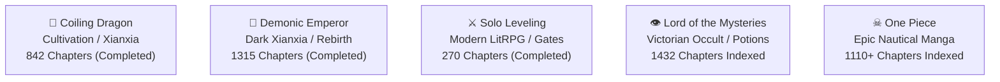

# OmniLore Universes & Cosmology Guide

> **Scope:** Canonical Lore Graphs, Power Cosmologies & Faction Ontologies  
> **Status:** Production Reference  
> **Version:** 2.0  

---

## 🌌 1. The 5 Benchmark Universes

OmniLore models five diverse fictional cosmologies to stress-test the temporal knowledge graph engine across cultivation, litRPG, steampunk occult, and epic manga.

---

## 📜 2. Universe Profiles & Power Structures

### 2.1 Coiling Dragon (`coiling-dragon`)
* **Status:** Completed (842 Chapters)
* **Author:** I Eat Tomatoes
* **Cosmology & Planes:**
  * **Yulan Continent:** Mortal starting world split by the Mountain Range of Magical Beasts.
  * **Infernal Realm:** Brutal higher plane of slaughter featuring the Violet Chaos Sea and Skyrite Mountains.
  * **Netherworld & Higher Planes:** Planes of Death, Fate, and Life.
* **Power System (Elemental Laws & Edicts):**
  * T1: Mortal (Warriors & Magi Ranks 1–9)
  * T2: Saint (Early, Middle, Peak)
  * T3: Demigod (Fusing 1–2 elemental mysteries)
  * T4: God (Mastering 1 full elemental law)
  * T5: Highgod (Mastering all 6 mysteries of an element)
  * T6: Paragon / Sovereign (Fused highgods and cosmic rulers)
  * T7: Hongmeng Master (Grand Mist Realm Creator)
* **Protagonist Journey:** Linley Baruch (Dragonblood Warrior $\rightarrow$ Saint Ch. 115 $\rightarrow$ God Ch. 450 $\rightarrow$ Sovereign Ch. 800 $\rightarrow$ 2nd Hongmeng Creator).

---

### 2.2 Demonic Emperor (`demonic-emperor`)
* **Status:** Completed (1315 Chapters)
* **Genre:** Dark Cultivation / Rebirth
* **Cosmology & Factions:**
  * **Tianyu Empire:** Central realm divided among the 7 Noble Houses and the imperial regent.
  * **Luo Clan:** Rising 8th Noble House commanded by Zhuo Fan.
  * **Sacred Mountains:** Ancient cultivation peaks holding world secrets.
* **Power System:**
  * T1: Foundation (Qi Gathering & Foundation Building)
  * T2: Bone Tempering & Qi Condensation
  * T3: Profound Heaven & Radiant Stage
  * T4: Ethereal Opening & Soul Tempering
  * T5: Genesis & Void Transformation
  * T6: Emperor Realm & Sovereign Apex
* **Protagonist Journey:** Zhuo Fan (Demonic Emperor reincarnation $\rightarrow$ Luo Clan steward $\rightarrow$ Blood Infant master $\rightarrow$ Apex Sovereign).

---

### 2.3 Solo Leveling (`solo-leveling`)
* **Status:** Completed (270 Chapters)
* **Author:** Chugong
* **Cosmology & Gates:**
  * **Earth:** Hunter Associations (Korea, USA, Japan), Double Dungeon (Cartenon Temple), Jeju Island.
  * **Dimensional Rifts:** Red Gates, Demon Castle (100 Floors), Land of Eternal Rest.
* **Power System (Hunter Ranks & Cosmic Monarchs):**
  * T1: E-Rank Hunter (Weakest Hunter)
  * T2: D-Rank & C-Rank
  * T3: B-Rank & A-Rank Elite
  * T4: S-Rank Hunter (National Disasters)
  * T5: National Level Hunter (Borrowing Ruler power)
  * T6: Shadow Monarch (Lord of the Dead / Army of 130,000+)
  * T7: Cosmic Sovereign (Monarch vs Ruler Apex)
* **Protagonist Journey:** Sung Jin-Woo (E-Rank $\rightarrow$ Double Dungeon Awakening $\rightarrow$ Job Change to Necromancer Ch. 45 $\rightarrow$ S-Rank Re-evaluation Ch. 80 $\rightarrow$ Full Shadow Monarch Ch. 165).

---

### 2.4 Lord of the Mysteries (`lord-of-the-mysteries`)
* **Status:** Ongoing (1432 Chapters Indexed)
* **Author:** Cuttlefish That Loves Diving
* **Cosmology & Continents:**
  * **Northern Continent:** Loen Kingdom (Backlund, Tingen Town), Intis Republic, Feynapotter.
  * **Mid-Seas:** The Berserk Sea, Rorsted Archipelago (Bayam), Bansy Harbor.
  * **Divine & Cursed Realms:** Sefirah Castle (Above the Gray Fog), Forsaken Land of the Gods.
* **Power System (The 22 Pathways of the Divine):**
  * T1: Sequence 9 & 8 (Initiate / Apprentice)
  * T2: Sequence 7 to 5 (Mid-Sequence Beyonders)
  * T3: Sequence 4 & 3 (Demigods / Saints)
  * T4: Sequence 2 & 1 (Angels / Archangels)
  * T5: Sequence 0 (True Gods)
  * T6: Above the Sequences / Great Old Ones (The Fool, Lord of Mysteries)
* **Protagonist Journey:** Klein Moretti (Clown $\rightarrow$ Magician $\rightarrow$ Faceless $\rightarrow$ Marionettist $\rightarrow$ Bizarro Sorcerer $\rightarrow$ Miracle Invoker $\rightarrow$ The Fool).

---

### 2.5 One Piece (`one-piece`)
* **Status:** Ongoing (1110+ Chapters Indexed)
* **Author:** Eiichiro Oda
* **Cosmology & Seas:**
  * **East Blue:** Romance Dawn, Loguetown.
  * **Grand Line & Red Line:** Alabasta, Skypiea, Water 7, Enies Lobby, Marineford, Mary Geoise.
  * **New World:** Fish-Man Island, Dressrosa, Whole Cake Island, Wano Kuni, Egghead Island, Elbaf.
* **Power System (Haki & Devil Fruit Awakenings):**
  * T1: East Blue Rookie (Bounties < 30M)
  * T2: Grand Line Pirate / Marine Officer (Bounties 30M–100M)
  * T3: Supernova / Shichibukai Veteran (Bounties 100M–500M)
  * T4: Yonko Commander / Marine Admiral (Bounties 500M–1.5B)
  * T5: Yonko / Fleet Admiral (Bounties 2B–4B)
  * T6: Pirate King & World Government Apex (Roger, Joy Boy, Imu)
* **Protagonist Journey:** Monkey D. Luffy (East Blue $\rightarrow$ Gear 2nd Ch. 390 $\rightarrow$ Marineford Ch. 574 $\rightarrow$ Gear 4th Ch. 784 $\rightarrow$ Gear 5th Sun God Nika Ch. 1044).

---

## 🛠️ 3. How to Add or Enrich a Universe

To register a new universe or expand an existing one:

1. **Create Data Directory:** `data/<new-slug>/graph.json`.
2. **Define Metadata:** Series title, author, total chapters, knowledge boundary, and type.
3. **Define Power System:** Ordered tiers (`order: 1..N`), tier names, descriptions, breakthrough criteria, phenomena, and mortality risk.
4. **Define Spatial Planes & Locations:**
   - Vector coordinates in the `1000 x 580` aspect ratio.
   - Danger ratings (EX, S, A, B, Safe).
   - First appearance chapter.
5. **Add Factions & Emblems:** Faction ID, name, leader ID, brand color, and SVG emblem in `public/assets/pixels/<slug>/factions/`.
6. **Populate Temporal Facts:** Append point-in-time facts (`stage`, `faction`, `location`, `relationship`, `status`) with `valid_from` chapter numbers.
7. **Add Theme in `src/domain/themes.ts`:** Rune symbol, accent border, badge styles, and narrative tagline.
8. **Verify with Test Suite:** Run `npm test` and `npm run build`.
